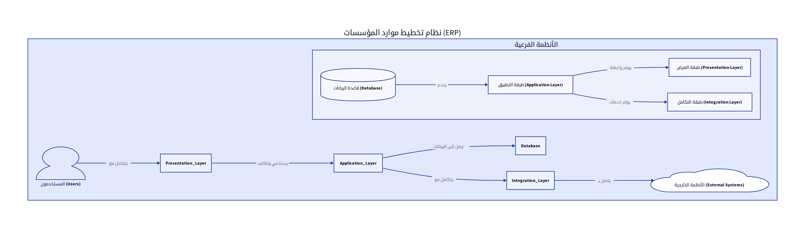

# الباب الأول: البنية الأساسية لنظام ERP والبنية التحتية (Core ERP Architecture and Infrastructure)

## 1.1. نماذج البنية المعمارية لأنظمة ERP

تُعد البنية المعمارية (Architecture) حجر الزاوية في تصميم أي نظام برمجي معقد، وأنظمة تخطيط موارد المؤسسات (ERP) ليست استثناءً. تحدد البنية كيفية تنظيم المكونات المختلفة للنظام، وكيفية تفاعلها مع بعضها البعض، ومع المستخدمين، ومع الأنظمة الخارجية. تطورت نماذج البنية المعمارية لأنظمة ERP على مر السنين لتلبية المتطلبات المتزايدة من حيث الأداء، قابلية التوسع، والمرونة [1] [3].

### 1.1.1. البنية ثنائية الطبقات (Two-tier Architecture)

في هذا النموذج، يتم تقسيم النظام إلى طبقتين رئيسيتين: طبقة العميل (Client Tier) وطبقة الخادم (Server Tier). تتولى طبقة العميل مسؤولية واجهة المستخدم ومعالجة المنطق الأساسي، بينما تتولى طبقة الخادم مسؤولية تخزين البيانات وإدارة قواعد البيانات. هذا النموذج بسيط وسهل التنفيذ للأنظمة الصغيرة، ولكنه يفتقر إلى قابلية التوسع والمرونة اللازمة للأنظمة الكبيرة والمعقدة [1].

### 1.1.2. البنية ثلاثية الطبقات (Three-tier Architecture)

يُعد هذا النموذج الأكثر شيوعاً في أنظمة ERP الحديثة. يتم تقسيم النظام إلى ثلاث طبقات متميزة: طبقة العرض (Presentation Tier)، طبقة المنطق (Application Tier)، وطبقة البيانات (Data Tier). تتولى طبقة العرض مسؤولية واجهة المستخدم، بينما تتولى طبقة المنطق معالجة قواعد العمل والمنطق البرمجي، وتتولى طبقة البيانات تخزين وإدارة قواعد البيانات. يوفر هذا النموذج قابلية أفضل للتوسع، ومرونة أكبر في التطوير والصيانة، وفصلاً واضحاً للمسؤوليات بين الطبقات [1] [3].

### 1.1.3. البنية متعددة الطبقات (N-tier Architecture)

تُعد البنية متعددة الطبقات امتداداً للبنية ثلاثية الطبقات، حيث يتم تقسيم طبقة المنطق (Application Tier) إلى عدة طبقات فرعية، مثل طبقة الخدمات (Services Layer)، طبقة قواعد العمل (Business Logic Layer)، وطبقة الوصول إلى البيانات (Data Access Layer). يتيح هذا النموذج مرونة أكبر في تصميم النظام، وقابلية عالية للتوسع، وإمكانية إعادة استخدام المكونات، مما يجعله مناسباً للأنظمة الكبيرة والمعقدة التي تتطلب أداءً عالياً ومرونة في التغيير [4].

### 1.1.4. البنية السحابية (Cloud-native Architecture) والميكروسيرفس (Microservices)

مع تزايد الاعتماد على الحوسبة السحابية، ظهرت البنية السحابية كنموذج حديث لتصميم أنظمة ERP. تعتمد هذه البنية على استخدام الخدمات السحابية (مثل AWS, Azure, Google Cloud) لتوفير البنية التحتية، وتستخدم مفهوم الميكروسيرفس (Microservices) لتقسيم النظام إلى خدمات صغيرة ومستقلة. يتميز هذا النموذج بقابلية عالية للتوسع، ومرونة في التطوير والنشر، ومقاومة للأخطاء، مما يجعله مثالياً للشركات التي تتطلب سرعة في الابتكار والتكيف مع المتغيرات [5].

## 1.2. تصميم قواعد البيانات لأنظمة ERP

تُعد قاعدة البيانات (Database) هي القلب النابض لأي نظام ERP، حيث تخزن جميع البيانات الحيوية للشركة. يجب أن يكون تصميم قاعدة البيانات قوياً، قابلاً للتوسع، وموثوقاً لضمان دقة البيانات وتوفرها [3].

### 1.2.1. اختيار نوع قاعدة البيانات (Relational vs. NoSQL)

*   **قواعد البيانات العلائقية (Relational Databases):** مثل MySQL, PostgreSQL, Oracle, SQL Server. تُعد الخيار التقليدي لأنظمة ERP نظراً لقدرتها على التعامل مع البيانات المنظمة، ودعمها للمعاملات (ACID properties)، وقدرتها على فرض تكامل البيانات من خلال العلاقات والجداول. تُفضل للبيانات المالية، المخزنية، وبيانات العملاء والموردين التي تتطلب دقة عالية وتكامل [3].
*   **قواعد البيانات غير العلائقية (NoSQL Databases):** مثل MongoDB, Cassandra, Redis. تُستخدم للتعامل مع البيانات غير المنظمة أو شبه المنظمة، وتتميز بقابلية عالية للتوسع الأفقي والأداء العالي في بعض السيناريوهات. يمكن استخدامها لتخزين بيانات السجلات (Logs)، بيانات المستخدمين غير الحساسة، أو البيانات التي تتطلب مرونة في الهيكل [3].

### 1.2.2. تصميم مخططات قواعد البيانات (Database Schemas) ومبادئ النمذجة

يجب أن يتم تصميم مخططات قواعد البيانات بعناية لضمان كفاءة تخزين البيانات واسترجاعها. تشمل المبادئ الأساسية:

*   **التطبيع (Normalization):** تقليل تكرار البيانات وتحسين تكاملها من خلال تقسيم الجداول إلى جداول أصغر وربطها بعلاقات. يساعد في تقليل حجم قاعدة البيانات وتحسين أداء الاستعلامات [3].
*   **الفهرسة (Indexing):** إنشاء فهارس على الأعمدة المستخدمة بشكل متكرر في الاستعلامات لتحسين سرعة البحث واسترجاع البيانات [3].
*   **العلاقات (Relationships):** تحديد العلاقات بين الجداول (واحد لواحد، واحد لمتعدد، متعدد لمتعدد) لضمان تكامل البيانات وتسهيل الاستعلامات المعقدة [3].

### 1.2.3. تخزين البيانات (Data Warehousing) وتحليلها

لتحليل البيانات التاريخية واستخراج رؤى قيمة، يمكن استخدام مستودعات البيانات (Data Warehouses). تُعد مستودعات البيانات قواعد بيانات مُحسّنة للاستعلامات التحليلية، وتخزن البيانات من مصادر متعددة في شكل مُجمّع. يمكن استخدام أدوات ذكاء الأعمال (Business Intelligence Tools) لتحليل هذه البيانات وإنشاء تقارير ولوحات معلومات [6].

## 1.3. تصميم واجهات برمجة التطبيقات (APIs) والتكامل

تُعد واجهات برمجة التطبيقات (APIs) هي البوابة التي تسمح للموديولات المختلفة داخل نظام ERP بالتفاعل مع بعضها البعض، ومع الأنظمة الخارجية. يجب أن تكون APIs مصممة بشكل جيد، موثقة، وآمنة لضمان التكامل السلس [7] [8].

### 1.3.1. مبادئ تصميم RESTful APIs

تُعد RESTful APIs هي المعيار الصناعي لتصميم واجهات برمجة التطبيقات على الويب. تعتمد على مبادئ REST (Representational State Transfer)، وتستخدم بروتوكول HTTP لإجراء العمليات (GET, POST, PUT, DELETE) على الموارد (Resources). تتميز بالبساطة، قابلية التوسع، والمرونة [7] [8].

### 1.3.2. استخدام GraphQL للتكامل المرن

GraphQL هي لغة استعلام للـ APIs وبيئة تشغيل لتنفيذ الاستعلامات باستخدام البيانات الموجودة لديك. تتيح للعملاء طلب البيانات التي يحتاجونها بالضبط، مما يقلل من حجم البيانات المنقولة ويحسن الأداء. يمكن استخدامها في السيناريوهات التي تتطلب مرونة عالية في استرجاع البيانات [7].

### 1.3.3. استراتيجيات التكامل مع الأنظمة الخارجية (Third-party Integrations)

*   **الربط المباشر (Direct Integration):** ربط نظام ERP مباشرة بالأنظمة الخارجية باستخدام APIs. مناسب للأنظمة التي تتطلب تكاملاً وثيقاً وتبادل بيانات في الوقت الفعلي [8].
*   **منصات التكامل (Integration Platforms):** استخدام منصات التكامل السحابية (iPaaS) لربط نظام ERP بالعديد من الأنظمة الخارجية. توفر هذه المنصات أدوات لتبسيط عملية التكامل وإدارة تدفقات البيانات [8].
*   **الرسائل وقوائم الانتظار (Messaging and Queues):** استخدام أنظمة الرسائل (مثل Kafka, RabbitMQ) لتبادل البيانات بين الأنظمة بشكل غير متزامن. مناسب للسيناريوهات التي تتطلب معالجة كميات كبيرة من البيانات أو التعامل مع الأنظمة التي قد تكون غير متوفرة بشكل مؤقت [8].

## 1.4. اعتبارات الأمان (Security Considerations)

يُعد أمان نظام ERP أمراً بالغ الأهمية لحماية البيانات الحساسة للشركة. يجب أن يتم تضمين اعتبارات الأمان في كل مرحلة من مراحل تصميم وتطوير النظام [15].

### 1.4.1. المصادقة (Authentication) والترخيص (Authorization)

*   **المصادقة:** التحقق من هوية المستخدم (مثل اسم المستخدم وكلمة المرور، المصادقة متعددة العوامل). يجب استخدام آليات مصادقة قوية لمنع الوصول غير المصرح به [15].
*   **الترخيص:** تحديد الصلاحيات التي يمتلكها المستخدم المصادق عليه (مثل الوصول إلى موديولات معينة، إجراء عمليات محددة). يجب تطبيق مبدأ الحد الأدنى من الامتيازات (Principle of Least Privilege) لضمان أن المستخدمين يمتلكون الصلاحيات اللازمة لأداء مهامهم فقط [15].

### 1.4.2. تشفير البيانات (Data Encryption) وحماية المعلومات الحساسة

يجب تشفير البيانات الحساسة (مثل البيانات المالية، بيانات العملاء) سواء كانت مخزنة في قاعدة البيانات (Encryption at Rest) أو أثناء نقلها عبر الشبكة (Encryption in Transit). يساعد ذلك في حماية البيانات من الوصول غير المصرح به حتى في حالة اختراق النظام [15].

### 1.4.3. إدارة الثغرات الأمنية (Vulnerability Management)

يجب إجراء اختبارات أمان منتظمة (مثل اختبار الاختراق، فحص الثغرات الأمنية) لتحديد ومعالجة أي نقاط ضعف في النظام. يجب أيضاً تحديث المكونات البرمجية بانتظام لضمان الحماية من أحدث التهديدات الأمنية [15].

## 1.5. قابلية التوسع والأداء (Scalability and Performance)

يجب أن يكون نظام ERP قادراً على التعامل مع زيادة حجم البيانات وعدد المستخدمين دون التأثير على الأداء. تُعد قابلية التوسع والأداء من العوامل الحاسمة لنجاح أي نظام ERP [1] [4].

### 1.5.1. تصميم الأنظمة القابلة للتوسع أفقياً وعمودياً

*   **التوسع الأفقي (Horizontal Scaling):** إضافة المزيد من الخوادم أو الموارد لزيادة قدرة النظام. يتم ذلك عادةً عن طريق توزيع الحمل على عدة خوادم (Load Balancing) أو استخدام قواعد بيانات موزعة (Distributed Databases) [4].
*   **التوسع العمودي (Vertical Scaling):** زيادة موارد الخادم الحالي (مثل إضافة المزيد من الذاكرة أو المعالجات). مناسب للأنظمة التي تتطلب أداءً عالياً ولكنها قد تصل إلى حدودها القصوى [4].

### 1.5.2. تحسين أداء قواعد البيانات والتطبيقات

*   **تحسين الاستعلامات (Query Optimization):** كتابة استعلامات فعالة لقواعد البيانات واستخدام الفهارس بشكل صحيح لتحسين سرعة استرجاع البيانات [4].
*   **التخزين المؤقت (Caching):** تخزين البيانات المستخدمة بشكل متكرر في الذاكرة المؤقتة لتقليل الحاجة إلى الوصول إلى قاعدة البيانات [4].
*   **تحسين الكود (Code Optimization):** كتابة كود فعال ومُحسّن لتقليل استهلاك الموارد وتحسين سرعة التنفيذ [4].

## 1.6. استراتيجيات النشر (Deployment Strategies)

تحدد استراتيجية النشر كيفية استضافة وتشغيل نظام ERP. يجب اختيار الاستراتيجية المناسبة بناءً على احتياجات الشركة، ميزانيتها، ومتطلبات الأمان [15].

### 1.6.1. النشر المحلي (On-premise)

يتم استضافة نظام ERP على خوادم الشركة الخاصة. يوفر هذا النموذج تحكماً كاملاً في البنية التحتية والبيانات، ولكنه يتطلب استثمارات كبيرة في الأجهزة، البرمجيات، وفريق الدعم [15].

### 1.6.2. النشر السحابي (Cloud Deployment)

يتم استضافة نظام ERP على خوادم مزود خدمة سحابية (مثل AWS, Azure, Google Cloud). يوفر هذا النموذج مرونة عالية، قابلية للتوسع، وتكاليف تشغيل أقل، ولكنه يتطلب الاعتماد على مزود الخدمة السحابية [15].

### 1.6.3. النشر الهجين (Hybrid Deployment)

يجمع هذا النموذج بين النشر المحلي والنشر السحابي. يمكن استضافة بعض الموديولات الحساسة محلياً، بينما يتم استضافة الموديولات الأخرى في السحابة. يوفر هذا النموذج مرونة في اختيار أفضل بيئة لكل مكون من مكونات النظام [15].

## المراجع (References)

[1] What Is ERP Architecture? Models, Types, and More [2024] - Spinnaker Support. (2024, August 2). Retrieved from https://www.spinnakersupport.com/blog/2024/08/02/erp-architecture/
[2] 8 Core Components of ERP Systems - NetSuite. (2026, April 7). Retrieved from https://www.netsuite.com/portal/resource/articles/erp/erp-systems-components.shtml
[3] ERP System Architecture Explained in Layman's Terms - Visual South. (2026, January 20). Retrieved from https://www.visualsouth.com/blog/architecture-of-erp
[4] What Is ERP System Architecture? (Benefits, Types & Differ) - Synconics. Retrieved from https://www.synconics.com/erp-architecture
[5] ERP Fundamentals: How Is ERP Built? Architecture Explained - Resulting IT. (2023, January 24). Retrieved from https://www.resulting-it.com/erp-insights-blog/build-erp-project-integration
[6] ERP System: Modules, Integrated Workings, Landscapes, Master ... - LinkedIn. (2025, October 21). Retrieved from https://www.linkedin.com/pulse/erp-system-modules-integrated-workings-landscapes-master-rahul-sharma-kwgxc
[7] Daftra API: Welcome - Daftra API. Retrieved from https://docs.daftara.dev/
[8] Integration using the Application Programming Interface (API) - Daftra. Retrieved from https://docs.daftra.com/en/tutorial/api/
[9] Api V2 Docs - Daftra. Retrieved from https://azmart.daftra.com/api_docs/v2/
[10] Endpoints Structure - Daftra API. Retrieved from https://docs.daftara.dev/1259001m0
[11] API - Daftra Knowledge Base. Retrieved from https://docs.daftra.com/en/category/developers/api-en/
[12] How to Conduct an Effective Inventory Audit: Best Practices - VersaCloud ERP. (2024, October 28). Retrieved from https://www.versaclouderp.com/blog/how-to-conduct-an-effective-inventory-audit-best-practices/
[13] A Guide to ERP Software for Financial Systems | RubinBrown. (2025, January 24). Retrieved from https://www.rubinbrown.com/insights-events/insight-articles/essential-erp-features-for-an-effective-financial-management-system/
[14] A Guide to Inventory Audits: Meaning, Types & Best Practices - QuickDice ERP. (2025, November 8). Retrieved from https://quickdiceerp.com/blog/a-guide-to-inventory-audits-meaning-types-best-practices
[15] ERP Implementation: The 9-Step Guide – Forbes Advisor. (2024, July 9). Retrieved from https://www.forbes.com/advisor/business/erp-implementation/
