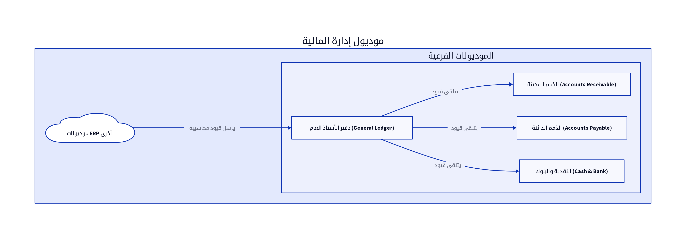

# الباب الثاني: موديول إدارة المالية (Financial Management Module)

## 2.1. نظرة عامة على الموديول

يُعد موديول إدارة المالية (Financial Management Module) العمود الفقري لأي نظام ERP، حيث يتولى مسؤولية تسجيل، معالجة، وتحليل جميع المعاملات المالية للشركة. يهدف هذا الموديول إلى توفير رؤية شاملة ودقيقة للوضع المالي، مما يدعم اتخاذ القرارات الاستراتيجية ويضمن الامتثال للمعايير المحاسبية. تشمل الوظائف الرئيسية لهذا الموديول دفتر الأستاذ العام (General Ledger)، إدارة الذمم الدائنة (Accounts Payable)، إدارة الذمم المدينة (Accounts Receivable)، إدارة النقدية والبنوك (Cash and Bank Management)، وإدارة الأصول الثابتة (Fixed Assets Management) [13].

## 2.2. تصميم قاعدة البيانات

يعتمد تصميم قاعدة البيانات لموديول المالية على مبادئ المحاسبة، مع التركيز على المرونة والدقة لتمثيل الهيكل المالي للشركة. فيما يلي المكونات الرئيسية لتصميم قاعدة البيانات:

### 2.2.1. دليل الحسابات (Chart of Accounts)

يُعد دليل الحسابات هو الهيكل التنظيمي لجميع الحسابات المالية للشركة. يتم تمثيله عادةً في قاعدة البيانات كجدول هرمي يسمح بتصنيف الحسابات إلى مجموعات رئيسية وفرعية. يجب أن يكون مرناً بما يكفي لاستيعاب التغييرات المستقبلية في الهيكل المالي للشركة.

| الحقل (Field) | نوع البيانات (Data Type) | الوصف (Description) |
|---------------|--------------------------|---------------------|
| `account_id`  | `INT (PK)`               | معرف الحساب الفريد |
| `account_code`| `VARCHAR(50)`            | كود الحساب (مثال: 1000-01-001) |
| `account_name`| `VARCHAR(255)`           | اسم الحساب (مثال: نقدية بالصندوق) |
| `account_type`| `ENUM`                   | نوع الحساب (أصول، خصوم، حقوق ملكية، إيرادات، مصروفات) |
| `parent_id`   | `INT (FK)`               | معرف الحساب الأم في الهيكل الهرمي |
| `is_active`   | `BOOLEAN`                | حالة الحساب (نشط/غير نشط) |

### 2.2.2. القيود اليومية (Journal Entries)

تُسجل جميع المعاملات المالية في شكل قيود يومية، والتي تعكس مبدأ القيد المزدوج (Double-Entry Bookkeeping). يتكون القيد اليومي من رأس (Header) يحتوي على معلومات عامة، وبنود (Lines) تفصيلية توضح الحسابات المدينة والدائنة.

**جدول `Journals` (رأس القيد اليومي):**

| الحقل (Field) | نوع البيانات (Data Type) | الوصف (Description) |
|---------------|--------------------------|---------------------|
| `journal_id`  | `INT (PK)`               | معرف القيد اليومي الفريد |
| `journal_number`| `VARCHAR(50)`            | رقم القيد اليومي (تسلسلي) |
| `date`        | `DATE`                   | تاريخ القيد |
| `description` | `TEXT`                   | وصف عام للقيد |
| `total_debit` | `DECIMAL(18,2)`          | إجمالي الجانب المدين |
| `total_credit`| `DECIMAL(18,2)`          | إجمالي الجانب الدائن |
| `currency_code`| `VARCHAR(3)`             | رمز العملة (مثال: USD) |
| `staff_id`    | `INT (FK)`               | معرف الموظف الذي أنشأ القيد |
| `entity_type` | `ENUM`                   | نوع الكيان المرتبط (فاتورة، مصروف، إلخ) [10] |
| `entity_id`   | `INT`                    | معرف الكيان المرتبط [10] |

**جدول `JournalTransactions` (بنود القيد اليومي):**

| الحقل (Field) | نوع البيانات (Data Type) | الوصف (Description) |
|---------------|--------------------------|---------------------|
| `transaction_id`| `INT (PK)`               | معرف حركة القيد الفريدة |
| `journal_id`  | `INT (FK)`               | معرف القيد اليومي المرتبط |
| `account_id`  | `INT (FK)`               | معرف الحساب المتأثر |
| `debit`       | `DECIMAL(18,2)`          | المبلغ المدين |
| `credit`      | `DECIMAL(18,2)`          | المبلغ الدائن |
| `description` | `TEXT`                   | وصف خاص بالحركة |
| `subkey`      | `ENUM`                   | مفتاح فرعي للكيان (عميل، مورد، إلخ) [10] |

### 2.2.3. المعاملات المالية الأخرى

بالإضافة إلى القيود اليومية، قد تتضمن قاعدة البيانات جداول لأنواع محددة من المعاملات مثل المصروفات (Expenses)، الإيرادات (Incomes)، والمدفوعات (Payments)، والتي يتم ربطها لاحقاً بالقيود اليومية أو تؤثر عليها بشكل مباشر.

**جدول `Expenses`:**

| الحقل (Field) | نوع البيانات (Data Type) | الوصف (Description) |
|---------------|--------------------------|---------------------|
| `expense_id`  | `INT (PK)`               | معرف المصروف الفريد |
| `date`        | `DATE`                   | تاريخ المصروف |
| `amount`      | `DECIMAL(18,2)`          | مبلغ المصروف |
| `description` | `TEXT`                   | وصف المصروف |
| `category_id` | `INT (FK)`               | معرف فئة المصروف |
| `vendor_id`   | `INT (FK)`               | معرف المورد (إن وجد) |

## 2.3. المنطق البرمجي الأساسي

يتضمن المنطق البرمجي لموديول المالية مجموعة من العمليات المعقدة التي تضمن دقة وسلامة البيانات المالية:

### 2.3.1. معالجة المعاملات (Transaction Processing)

عند إنشاء فاتورة مبيعات، أو تسجيل مصروف، أو استلام دفعة، يقوم النظام تلقائياً بإنشاء القيود المحاسبية اللازمة. يجب أن تضمن هذه العملية مبدأ القيد المزدوج، حيث يكون إجمالي الجانب المدين مساوياً لإجمالي الجانب الدائن لكل قيد [13].

### 2.3.2. ترحيل القيود إلى دفتر الأستاذ العام (GL Postings)

بعد إنشاء القيود اليومية، يتم ترحيلها إلى دفتر الأستاذ العام (General Ledger)، وهو السجل الرئيسي لجميع الحسابات المالية. يتم تحديث أرصدة الحسابات بشكل مستمر لتعكس أحدث المعاملات. يمكن أن يتم الترحيل بشكل فوري (Real-time) أو على دفعات (Batch Processing) [13].

### 2.3.3. التسويات البنكية (Bank Reconciliation)

تُعد التسوية البنكية عملية مطابقة أرصدة الحسابات البنكية في النظام مع كشوف الحسابات البنكية الفعلية. يتضمن المنطق البرمجي آليات لمقارنة المعاملات وتحديد أي فروقات، مما يضمن دقة سجلات النقدية والبنوك [13].

## 2.4. واجهات برمجة التطبيقات (APIs)

تُعد APIs ضرورية لتمكين التفاعل بين موديول المالية والموديولات الأخرى، وكذلك مع الأنظمة الخارجية. فيما يلي أمثلة على APIs الرئيسية لموديول المالية:

*   `POST /journals`: لإنشاء قيد يومي جديد. يتطلب هذا الـ API بيانات رأس القيد (مثل `journal_number`, `date`, `description`, `total_debit`, `total_credit`, `currency_code`) وبنود القيد (مثل `account_id`, `debit`, `credit`) [10].
*   `GET /journals`: لاستعراض القيود اليومية. يمكن أن يدعم فلاتر للبحث حسب التاريخ، رقم القيد، أو نوع الكيان المرتبط [10].
*   `GET /journal_accounts`: لاستعراض دليل الحسابات. يمكن أن يدعم فلاتر للبحث حسب نوع الحساب أو اسم الحساب [10].
*   `GET /expenses`: لاستعراض المصروفات المسجلة. يمكن أن يدعم فلاتر للبحث حسب التاريخ، الفئة، أو المورد [10].
*   `POST /expenses`: لإضافة مصروف جديد. يتطلب بيانات المصروف مثل `date`, `amount`, `description`, `category_id` [10].
*   `GET /incomes`: لاستعراض الإيرادات المسجلة. يمكن أن يدعم فلاتر للبحث حسب التاريخ، الفئة، أو العميل [10].
*   `POST /incomes`: لإضافة إيراد جديد. يتطلب بيانات الإيراد مثل `date`, `amount`, `description`, `category_id` [10].

## 2.5. التقارير المالية

يوفر موديول المالية مجموعة من التقارير الأساسية التي تعكس الأداء المالي للشركة:

*   **قائمة الدخل (Income Statement):** تُظهر الإيرادات والمصروفات وصافي الربح أو الخسارة خلال فترة زمنية محددة. يتم تجميع البيانات من حسابات الإيرادات والمصروفات في دفتر الأستاذ العام [13].
*   **الميزانية العمومية (Balance Sheet):** تُقدم لقطة للوضع المالي للشركة في نقطة زمنية محددة، وتعرض الأصول والخصوم وحقوق الملكية. يتم تجميع البيانات من حسابات الأصول والخصوم وحقوق الملكية في دفتر الأستاذ العام [13].
*   **قائمة التدفقات النقدية (Cash Flow Statement):** تُوضح حركة النقدية الداخلة والخارجة من الأنشطة التشغيلية، الاستثمارية، والتمويلية. يتم تجميع البيانات من سجلات النقدية والبنوك [13].
*   **ميزان المراجعة (Trial Balance):** يُعد قائمة بجميع أرصدة الحسابات في دفتر الأستاذ العام في تاريخ معين، ويستخدم للتأكد من أن إجمالي الأرصدة المدينة يساوي إجمالي الأرصدة الدائنة [13].

## المراجع (References)

[1] What Is ERP Architecture? Models, Types, and More [2024] - Spinnaker Support. (2024, August 2). Retrieved from https://www.spinnakersupport.com/blog/2024/08/02/erp-architecture/
[2] 8 Core Components of ERP Systems - NetSuite. (2026, April 7). Retrieved from https://www.netsuite.com/portal/resource/articles/erp/erp-systems-components.shtml
[3] ERP System Architecture Explained in Layman's Terms - Visual South. (2026, January 20). Retrieved from https://www.visualsouth.com/blog/architecture-of-erp
[4] What Is ERP System Architecture? (Benefits, Types & Differ) - Synconics. Retrieved from https://www.synconics.com/erp-architecture
[5] ERP Fundamentals: How Is ERP Built? Architecture Explained - Resulting IT. (2023, January 24). Retrieved from https://www.resulting-it.com/erp-insights-blog/build-erp-project-integration
[6] ERP System: Modules, Integrated Workings, Landscapes, Master ... - LinkedIn. (2025, October 21). Retrieved from https://www.linkedin.com/pulse/erp-system-modules-integrated-workings-landscapes-master-rahul-sharma-kwgxc
[7] Daftra API: Welcome - Daftra API. Retrieved from https://docs.daftara.dev/
[8] Integration using the Application Programming Interface (API) - Daftra. Retrieved from https://docs.daftara.com/en/tutorial/api/
[9] Api V2 Docs - Daftra. Retrieved from https://azmart.daftra.com/api_docs/v2/
[10] Endpoints Structure - Daftra API. Retrieved from https://docs.daftara.dev/1259001m0
[11] API - Daftra Knowledge Base. Retrieved from https://docs.daftara.com/en/category/developers/api-en/
[12] How to Conduct an Effective Inventory Audit: Best Practices - VersaCloud ERP. (2024, October 28). Retrieved from https://www.versaclouderp.com/blog/how-to-conduct-an-effective-inventory-audit-best-practices/
[13] A Guide to ERP Software for Financial Systems | RubinBrown. (2025, January 24). Retrieved from https://www.rubinbrown.com/insights-events/insight-articles/essential-erp-features-for-an-effective-financial-management-system/
[14] A Guide to Inventory Audits: Meaning, Types & Best Practices - QuickDice ERP. (2025, November 8). Retrieved from https://quickdiceerp.com/blog/a-guide-to-inventory-audits-meaning-types-best-practices
[15] ERP Implementation: The 9-Step Guide – Forbes Advisor. (2024, July 9). Retrieved from https://www.forbes.com/advisor/business/erp-implementation/
