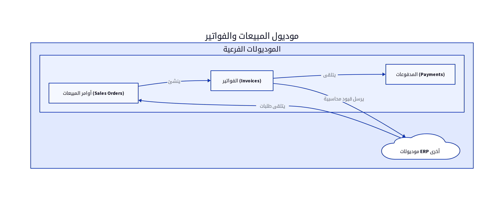

# الباب الثالث: موديول المبيعات والفواتير (Sales and Invoicing Module)

## 3.1. نظرة عامة على الموديول

يُعد موديول المبيعات والفواتير (Sales and Invoicing Module) جزءاً حيوياً من أي نظام ERP، حيث يدير جميع العمليات المتعلقة ببيع المنتجات والخدمات للعملاء. يهدف هذا الموديول إلى تبسيط دورة المبيعات، بدءاً من إنشاء عروض الأسعار وأوامر المبيعات، مروراً بإصدار الفواتير، وحتى تتبع المدفوعات. يضمن هذا الموديول كفاءة عمليات البيع، دقة الفواتير، وتحسين تجربة العملاء [2].

## 3.2. تصميم قاعدة البيانات

يركز تصميم قاعدة البيانات لموديول المبيعات والفواتير على تتبع جميع جوانب عملية البيع، من معلومات العميل والمنتج إلى تفاصيل الفاتورة والمدفوعات. فيما يلي المكونات الرئيسية لتصميم قاعدة البيانات:

### 3.2.1. أوامر المبيعات (Sales Orders)

تُسجل أوامر المبيعات طلبات العملاء للمنتجات أو الخدمات قبل إصدار الفاتورة النهائية. يمكن أن تمر أوامر المبيعات بحالات مختلفة (معلق، معتمد، منفذ جزئياً، منفذ بالكامل).

| الحقل (Field) | نوع البيانات (Data Type) | الوصف (Description) |
|---------------|--------------------------|---------------------|
| `order_id`    | `INT (PK)`               | معرف أمر المبيعات الفريد |
| `order_number`| `VARCHAR(50)`            | رقم أمر المبيعات (تسلسلي) |
| `client_id`   | `INT (FK)`               | معرف العميل المرتبط |
| `order_date`  | `DATE`                   | تاريخ الطلب |
| `status`      | `ENUM`                   | حالة الطلب (معلق، معتمد، منفذ) |
| `total_amount`| `DECIMAL(18,2)`          | إجمالي مبلغ الطلب |
| `currency_code`| `VARCHAR(3)`             | رمز العملة |

### 3.2.2. الفواتير (Invoices)

تُعد الفواتير المستندات الرسمية التي تُصدر للعملاء لطلب الدفع مقابل المنتجات أو الخدمات المقدمة. تتكون الفاتورة من رأس (Header) وبنود (Items) تفصيلية.

**جدول `Invoices` (رأس الفاتورة):**

| الحقل (Field) | نوع البيانات (Data Type) | الوصف (Description) |
|---------------|--------------------------|---------------------|
| `invoice_id`  | `INT (PK)`               | معرف الفاتورة الفريد |
| `invoice_number`| `VARCHAR(50)`            | رقم الفاتورة (تسلسلي) [10] |
| `client_id`   | `INT (FK)`               | معرف العميل المرتبط [10] |
| `date`        | `DATE`                   | تاريخ الفاتورة [10] |
| `due_date`    | `DATE`                   | تاريخ الاستحقاق |
| `total_amount`| `DECIMAL(18,2)`          | إجمالي مبلغ الفاتورة |
| `tax_amount`  | `DECIMAL(18,2)`          | مبلغ الضريبة |
| `discount_amount`| `DECIMAL(18,2)`          | مبلغ الخصم [10] |
| `currency_code`| `VARCHAR(3)`             | رمز العملة [10] |
| `status`      | `ENUM`                   | حالة الفاتورة (مدفوعة، مستحقة، جزئية) |
| `notes`       | `TEXT`                   | ملاحظات الفاتورة [10] |
| `staff_id`    | `INT (FK)`               | معرف الموظف الذي أنشأ الفاتورة [10] |

**جدول `InvoiceItems` (بنود الفاتورة):**

| الحقل (Field) | نوع البيانات (Data Type) | الوصف (Description) |
|---------------|--------------------------|---------------------|
| `item_id`     | `INT (PK)`               | معرف البند الفريد |
| `invoice_id`  | `INT (FK)`               | معرف الفاتورة المرتبطة |
| `product_id`  | `INT (FK)`               | معرف المنتج المرتبط [10] |
| `item_name`   | `VARCHAR(255)`           | اسم المنتج/الخدمة [10] |
| `description` | `TEXT`                   | وصف البند [10] |
| `quantity`    | `DECIMAL(18,2)`          | الكمية [10] |
| `unit_price`  | `DECIMAL(18,2)`          | سعر الوحدة [10] |
| `total_price` | `DECIMAL(18,2)`          | إجمالي سعر البند |
| `tax1`        | `DECIMAL(18,2)`          | الضريبة الأولى [10] |
| `tax2`        | `DECIMAL(18,2)`          | الضريبة الثانية [10] |
| `discount`    | `DECIMAL(18,2)`          | خصم على البند [10] |

### 3.2.3. العملاء (Clients)

يتم ربط الفواتير بملفات العملاء المخزنة في موديول العملاء والموردين. يجب أن يتضمن جدول العملاء معلومات أساسية مثل الاسم، العنوان، ومعلومات الاتصال.

### 3.2.4. المنتجات (Products)

يتم ربط بنود الفواتير بالمنتجات أو الخدمات المخزنة في موديول المنتجات والمخزون. يجب أن يتضمن جدول المنتجات معلومات مثل اسم المنتج، الوصف، وسعر البيع.

## 3.3. المنطق البرمجي الأساسي

يتضمن المنطق البرمجي لموديول المبيعات والفواتير مجموعة من العمليات التي تضمن سير دورة المبيعات بسلاسة ودقة:

### 3.3.1. إنشاء أوامر المبيعات والفواتير

عند إنشاء أمر مبيعات أو فاتورة، يقوم النظام بالتحقق من توفر المنتجات في المخزون، وتطبيق قواعد التسعير والخصومات، وحساب الضرائب. يتم إنشاء قيد محاسبي تلقائي في موديول المالية لتسجيل الإيرادات والذمم المدينة [10].

### 3.3.2. تطبيق قواعد التسعير والخصومات

يمكن للنظام تطبيق قواعد تسعير مختلفة بناءً على العميل، الكمية، أو نوع المنتج. كما يمكن تطبيق خصومات على مستوى البند أو على إجمالي الفاتورة. يجب أن يكون المنطق البرمجي مرناً بما يكفي للتعامل مع هذه القواعد المعقدة [10].

### 3.3.3. تحديث حالة الفواتير

يتم تحديث حالة الفاتورة تلقائياً بناءً على المدفوعات المستلمة. يمكن أن تكون الفاتورة 
مدفوعة بالكامل، مدفوعة جزئياً، أو مستحقة. يتم إرسال تنبيهات للعملاء عند اقتراب موعد الاستحقاق أو عند تأخر الدفع.

## 3.4. واجهات برمجة التطبيقات (APIs)

تُعد APIs لموديول المبيعات والفواتير ضرورية لتمكين إنشاء، استعراض، وتعديل الفواتير وأوامر المبيعات، بالإضافة إلى التكامل مع أنظمة أخرى مثل بوابات الدفع والمتاجر الإلكترونية.

*   `POST /invoices`: لإنشاء فاتورة جديدة. يتطلب هذا الـ API بيانات رأس الفاتورة (مثل `client_id`, `date`, `due_date`, `currency_code`, `discount_amount`, `notes`) وبنود الفاتورة (مثل `product_id`, `item_name`, `quantity`, `unit_price`, `tax1`, `tax2`, `discount`) [10].
*   `GET /invoices`: لاستعراض جميع الفواتير. يمكن أن يدعم فلاتر للبحث حسب العميل، التاريخ، الحالة، أو رقم الفاتورة [10].
*   `GET /invoices/{id}`: لاستعراض تفاصيل فاتورة محددة باستخدام معرف الفاتورة (`invoice_id`) [10].
*   `PUT /invoices/{id}`: لتعديل فاتورة موجودة. يتطلب معرف الفاتورة (`invoice_id`) والبيانات المراد تحديثها [10].
*   `DELETE /invoices/{id}`: لحذف فاتورة. يتطلب معرف الفاتورة (`invoice_id`). يجب أن يتم التحقق من عدم وجود مدفوعات مرتبطة بالفاتورة قبل الحذف [10].
*   `POST /sales_orders`: لإنشاء أمر مبيعات جديد. يتطلب بيانات مشابهة لإنشاء الفاتورة ولكن بحالة أولية مختلفة.
*   `GET /sales_orders`: لاستعراض أوامر المبيعات.

## 3.5. التقارير

يوفر موديول المبيعات والفواتير مجموعة من التقارير التحليلية التي تساعد في تقييم أداء المبيعات وتتبع الذمم المدينة:

*   **مبيعات حسب العميل (Sales by Customer):** يُظهر إجمالي المبيعات لكل عميل خلال فترة محددة، مما يساعد في تحديد العملاء الأكثر قيمة [6].
*   **مبيعات حسب المنتج (Sales by Product):** يُظهر المنتجات الأكثر مبيعاً والأقل مبيعاً، مما يساعد في إدارة المخزون وتخطيط الإنتاج [6].
*   **تحليل أعمار الفواتير (Invoice Aging):** يُصنف الفواتير المستحقة بناءً على مدة تأخرها (مثال: 0-30 يوم، 31-60 يوم، 61-90 يوم، أكثر من 90 يوم)، مما يساعد في إدارة التحصيلات [6].
*   **تقرير الإيرادات (Revenue Report):** يُقدم ملخصاً للإيرادات المحققة خلال فترة زمنية محددة، مع تفصيل حسب نوع المنتج أو الخدمة.

## المراجع (References)

[1] What Is ERP Architecture? Models, Types, and More [2024] - Spinnaker Support. (2024, August 2). Retrieved from https://www.spinnakersupport.com/blog/2024/08/02/erp-architecture/
[2] 8 Core Components of ERP Systems - NetSuite. (2026, April 7). Retrieved from https://www.netsuite.com/portal/resource/articles/erp/erp-systems-components.shtml
[3] ERP System Architecture Explained in Layman's Terms - Visual South. (2026, January 20). Retrieved from https://www.visualsouth.com/blog/architecture-of-erp
[4] What Is ERP System Architecture? (Benefits, Types & Differ) - Synconics. Retrieved from https://www.synconics.com/erp-architecture
[5] ERP Fundamentals: How Is ERP Built? Architecture Explained - Resulting IT. (2023, January 24). Retrieved from https://www.resulting-it.com/erp-insights-blog/build-erp-project-integration
[6] ERP System: Modules, Integrated Workings, Landscapes, Master ... - LinkedIn. (2025, October 21). Retrieved from https://www.linkedin.com/pulse/erp-system-modules-integrated-workings-landscapes-master-rahul-sharma-kwgxc
[7] Daftra API: Welcome - Daftra API. Retrieved from https://docs.daftara.dev/
[8] Integration using the Application Programming Interface (API) - Daftra. Retrieved from https://docs.daftra.com/en/tutorial/api/
[9] Api V2 Docs - Daftra. Retrieved from https://azmart.daftra.com/api_docs/v2/
[10] Endpoints Structure - Daftra API. Retrieved from https://docs.daftara.dev/1259001m0
[11] API - Daftra Knowledge Base. Retrieved from https://docs.daftara.com/en/category/developers/api-en/
[12] How to Conduct an Effective Inventory Audit: Best Practices - VersaCloud ERP. (2024, October 28). Retrieved from https://www.versaclouderp.com/blog/how-to-conduct-an-effective-inventory-audit-best-practices/
[13] A Guide to ERP Software for Financial Systems | RubinBrown. (2025, January 24). Retrieved from https://www.rubinbrown.com/insights-events/insight-articles/essential-erp-features-for-an-effective-financial-management-system/
[14] A Guide to Inventory Audits: Meaning, Types & Best Practices - QuickDice ERP. (2025, November 8). Retrieved from https://quickdiceerp.com/blog/a-guide-to-inventory-audits-meaning-types-best-practices
[15] ERP Implementation: The 9-Step Guide – Forbes Advisor. (2024, July 9). Retrieved from https://www.forbes.com/advisor/business/erp-implementation/
