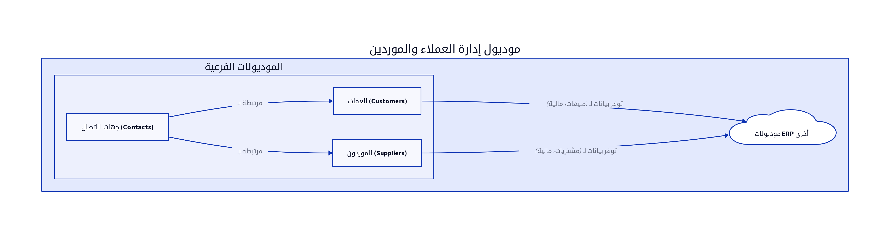

# الباب الرابع: موديول إدارة العملاء والموردين (Customer and Supplier Management Module)

## 4.1. نظرة عامة على الموديول

يُعد موديول إدارة العملاء والموردين (Customer and Supplier Management Module) بمثابة مركز معلومات لجميع الأطراف الخارجية التي تتعامل معها المؤسسة. يهدف هذا الموديول إلى تنظيم وتخزين بيانات العملاء والموردين بشكل مركزي، مما يسهل عمليات التواصل، المبيعات، المشتريات، وإدارة العلاقات. يضمن هذا الموديول دقة البيانات وتوفرها لجميع الموديولات الأخرى التي تتطلب معلومات عن العملاء والموردين [2].

## 4.2. تصميم قاعدة البيانات

يركز تصميم قاعدة البيانات لهذا الموديول على التقاط جميع المعلومات ذات الصلة بالعملاء والموردين، بما في ذلك تفاصيل الاتصال، العناوين، والإعدادات المالية. فيما يلي المكونات الرئيسية لتصميم قاعدة البيانات:

### 4.2.1. ملفات العملاء (Client Profiles)

يخزن هذا الجدول المعلومات الأساسية والتفصيلية لكل عميل، سواء كان فرداً أو شركة.

| الحقل (Field) | نوع البيانات (Data Type) | الوصف (Description) |
|---------------|--------------------------|---------------------|
| `client_id`   | `INT (PK)`               | معرف العميل الفريد |
| `client_type` | `ENUM`                   | نوع العميل (فردي، تجاري) |
| `first_name`  | `VARCHAR(100)`           | الاسم الأول للعميل (للأفراد) [10] |
| `last_name`   | `VARCHAR(100)`           | الاسم الأخير للعميل (للأفراد) [10] |
| `business_name`| `VARCHAR(255)`           | الاسم التجاري للعميل (للشركات) [10] |
| `email`       | `VARCHAR(255)`           | البريد الإلكتروني الأساسي [10] |
| `phone_number`| `VARCHAR(50)`            | رقم الهاتف الأساسي |
| `tax_id`      | `VARCHAR(50)`            | الرقم الضريبي للعميل (إن وجد) [10] |
| `credit_limit`| `DECIMAL(18,2)`          | الحد الائتماني المسموح به [10] |
| `credit_days` | `INT`                    | عدد أيام الائتمان المسموح بها [10] |
| `currency_code`| `VARCHAR(3)`             | العملة الافتراضية للعميل [10] |
| `price_group_id`| `INT (FK)`               | معرف مجموعة الأسعار المخصصة للعميل [10] |
| `category_id` | `INT (FK)`               | معرف فئة العميل (لتصنيف العملاء) [10] |
| `notes`       | `TEXT`                   | ملاحظات إضافية عن العميل [10] |
| `is_active`   | `BOOLEAN`                | حالة العميل (نشط/غير نشط) |

### 4.2.2. ملفات الموردين (Supplier Profiles)

يخزن هذا الجدول المعلومات الأساسية والتفصيلية لكل مورد تتعامل معه المؤسسة.

| الحقل (Field) | نوع البيانات (Data Type) | الوصف (Description) |
|---------------|--------------------------|---------------------|
| `supplier_id` | `INT (PK)`               | معرف المورد الفريد |
| `supplier_name`| `VARCHAR(255)`           | اسم المورد (شركة أو فرد) |
| `contact_person`| `VARCHAR(255)`           | اسم جهة الاتصال الرئيسية لدى المورد |
| `email`       | `VARCHAR(255)`           | البريد الإلكتروني الأساسي |
| `phone_number`| `VARCHAR(50)`            | رقم الهاتف الأساسي |
| `tax_id`      | `VARCHAR(50)`            | الرقم الضريبي للمورد (إن وجد) |
| `payment_terms`| `VARCHAR(100)`           | شروط الدفع المتفق عليها |
| `currency_code`| `VARCHAR(3)`             | العملة الافتراضية للمورد |
| `notes`       | `TEXT`                   | ملاحظات إضافية عن المورد |
| `is_active`   | `BOOLEAN`                | حالة المورد (نشط/غير نشط) |

### 4.2.3. معلومات الاتصال والعناوين (Contact Information and Addresses)

يمكن أن يكون للعميل أو المورد الواحد عدة عناوين أو جهات اتصال. لذلك، يتم استخدام جداول منفصلة لربط هذه المعلومات بالكيان الرئيسي.

**جدول `Addresses`:**

| الحقل (Field) | نوع البيانات (Data Type) | الوصف (Description) |
|---------------|--------------------------|---------------------|
| `address_id`  | `INT (PK)`               | معرف العنوان الفريد |
| `entity_type` | `ENUM`                   | نوع الكيان (عميل، مورد) |
| `entity_id`   | `INT (FK)`               | معرف الكيان المرتبط |
| `address_line1`| `VARCHAR(255)`           | السطر الأول من العنوان [10] |
| `address_line2`| `VARCHAR(255)`           | السطر الثاني من العنوان (اختياري) [10] |
| `city`        | `VARCHAR(100)`           | المدينة [10] |
| `state`       | `VARCHAR(100)`           | الولاية/المقاطعة [10] |
| `postal_code` | `VARCHAR(20)`            | الرمز البريدي [10] |
| `country_code`| `VARCHAR(3)`             | رمز الدولة [10] |
| `is_shipping` | `BOOLEAN`                | هل هو عنوان شحن افتراضي؟ [10] |
| `is_billing`  | `BOOLEAN`                | هل هو عنوان فواتير افتراضي؟ |

**جدول `Contacts`:**

| الحقل (Field) | نوع البيانات (Data Type) | الوصف (Description) |
|---------------|--------------------------|---------------------|
| `contact_id`  | `INT (PK)`               | معرف جهة الاتصال الفريد |
| `entity_type` | `ENUM`                   | نوع الكيان (عميل، مورد) |
| `entity_id`   | `INT (FK)`               | معرف الكيان المرتبط |
| `name`        | `VARCHAR(255)`           | اسم جهة الاتصال |
| `email`       | `VARCHAR(255)`           | البريد الإلكتروني لجهة الاتصال |
| `phone_number`| `VARCHAR(50)`            | رقم الهاتف لجهة الاتصال |
| `role`        | `VARCHAR(100)`           | دور جهة الاتصال (مثال: مدير مبيعات) |

## 4.3. المنطق البرمجي الأساسي

يتضمن المنطق البرمجي لموديول إدارة العملاء والموردين مجموعة من العمليات التي تضمن إدارة فعالة لبيانات جهات الاتصال:

### 4.3.1. إنشاء وتحديث ملفات العملاء والموردين

يتيح النظام للمستخدمين إنشاء ملفات جديدة للعملاء والموردين، وتحديث المعلومات الموجودة. يجب أن يتضمن المنطق البرمجي آليات للتحقق من صحة البيانات (Data Validation) لضمان إدخال معلومات دقيقة وكاملة، مثل التحقق من تنسيق البريد الإلكتروني أو رقم الهاتف [10].

### 4.3.2. إدارة العلاقات (Relationship Management)

يمكن للنظام تتبع العلاقات بين العملاء والموردين، مثل تحديد العملاء الذين هم أيضاً موردون، أو ربط جهات اتصال متعددة بعميل واحد. يساعد هذا في بناء رؤية شاملة لجميع التفاعلات مع الأطراف الخارجية.

### 4.3.3. تصنيف العملاء والموردين

يمكن تصنيف العملاء والموردين بناءً على معايير مختلفة (مثل الفئة، المنطقة الجغرافية، حجم الأعمال). يسهل هذا التصنيف عمليات الفلترة والبحث في التقارير، ويساعد في تطبيق استراتيجيات تسويقية أو شرائية مستهدفة [10].

## 4.4. واجهات برمجة التطبيقات (APIs)

تُعد APIs لموديول إدارة العملاء والموردين ضرورية لتمكين الموديولات الأخرى من الوصول إلى بيانات جهات الاتصال وتحديثها، بالإضافة إلى التكامل مع أنظمة CRM أو أنظمة إدارة علاقات الموردين (SRM).

*   `GET /clients`: لاستعراض جميع العملاء. يمكن أن يدعم فلاتر للبحث حسب الاسم، البريد الإلكتروني، الفئة، أو الحالة [10].
*   `GET /clients/{id}`: لاستعراض تفاصيل عميل محدد باستخدام معرف العميل (`client_id`) [10].
*   `POST /clients`: لإضافة عميل جديد. يتطلب هذا الـ API بيانات العميل الأساسية مثل `client_type`, `first_name` أو `business_name`, `email`, `phone_number`, `tax_id`, `credit_limit`, `currency_code` [10].
*   `PUT /clients/{id}`: لتعديل بيانات عميل موجود. يتطلب معرف العميل (`client_id`) والبيانات المراد تحديثها [10].
*   `DELETE /clients/{id}`: لحذف عميل. يتطلب معرف العميل (`client_id`). يجب أن يتم التحقق من عدم وجود معاملات مالية أو فواتير مرتبطة بالعميل قبل الحذف [10].
*   `GET /suppliers`: لاستعراض جميع الموردين. يمكن أن يدعم فلاتر للبحث حسب الاسم، البريد الإلكتروني، أو الحالة [10].
*   `GET /suppliers/{id}`: لاستعراض تفاصيل مورد محدد باستخدام معرف المورد (`supplier_id`) [10].
*   `POST /suppliers`: لإضافة مورد جديد. يتطلب هذا الـ API بيانات المورد الأساسية مثل `supplier_name`, `contact_person`, `email`, `phone_number`, `tax_id`, `payment_terms`, `currency_code` [10].
*   `PUT /suppliers/{id}`: لتعديل بيانات مورد موجود. يتطلب معرف المورد (`supplier_id`) والبيانات المراد تحديثها [10].
*   `DELETE /suppliers/{id}`: لحذف مورد. يتطلب معرف المورد (`supplier_id`). يجب أن يتم التحقق من عدم وجود أوامر شراء أو فواتير مشتريات مرتبطة بالمورد قبل الحذف [10].

## 4.5. التقارير

يوفر موديول إدارة العملاء والموردين مجموعة من التقارير التي تساعد في تحليل العلاقات التجارية وتقييم الأداء:

*   **قائمة العملاء/الموردين (Client/Supplier List):** تقرير يعرض جميع العملاء أو الموردين مع معلوماتهم الأساسية [6].
*   **تقسيم العملاء (Customer Segmentation):** تقرير يقسم العملاء إلى مجموعات بناءً على معايير محددة (مثل حجم المبيعات، المنطقة الجغرافية) [6].
*   **تقييم أداء الموردين (Supplier Performance Evaluation):** تقرير يقيم أداء الموردين بناءً على معايير مثل جودة المنتجات، الالتزام بمواعيد التسليم، والأسعار [6].
*   **أعمار الذمم المدينة/الدائنة (Accounts Receivable/Payable Aging):** تقارير تفصيلية عن المبالغ المستحقة من العملاء أو للموردين، مصنفة حسب مدة الاستحقاق.

## المراجع (References)

[1] What Is ERP Architecture? Models, Types, and More [2024] - Spinnaker Support. (2024, August 2). Retrieved from https://www.spinnakersupport.com/blog/2024/08/02/erp-architecture/
[2] 8 Core Components of ERP Systems - NetSuite. (2026, April 7). Retrieved from https://www.netsuite.com/portal/resource/articles/erp/erp-systems-components.shtml
[3] ERP System Architecture Explained in Layman's Terms - Visual South. (2026, January 20). Retrieved from https://www.visualsouth.com/blog/architecture-of-erp
[4] What Is ERP System Architecture? (Benefits, Types & Differ) - Synconics. Retrieved from https://www.synconics.com/erp-architecture
[5] ERP Fundamentals: How Is ERP Built? Architecture Explained - Resulting IT. (2023, January 24). Retrieved from https://www.resulting-it.com/erp-insights-blog/build-erp-project-integration
[6] ERP System: Modules, Integrated Workings, Landscapes, Master ... - LinkedIn. (2025, October 21). Retrieved from https://www.linkedin.com/pulse/erp-system-modules-integrated-workings-landscapes-master-rahul-sharma-kwgxc
[7] Daftra API: Welcome - Daftra API. Retrieved from https://docs.daftara.dev/
[8] Integration using the Application Programming Interface (API) - Daftra. Retrieved from https://docs.daftara.com/en/tutorial/api/
[9] Api V2 Docs - Daftra. Retrieved from https://azmart.daftra.com/api_docs/v2/
[10] Endpoints Structure - Daftra API. Retrieved from https://docs.daftara.dev/1259001m0
[11] API - Daftra Knowledge Base. Retrieved from https://docs.daftara.com/en/category/developers/api-en/
[12] How to Conduct an Effective Inventory Audit: Best Practices - VersaCloud ERP. (2024, October 28). Retrieved from https://www.versaclouderp.com/blog/how-to-conduct-an-effective-inventory-audit-best-practices/
[13] A Guide to ERP Software for Financial Systems | RubinBrown. (2025, January 24). Retrieved from https://www.rubinbrown.com/insights-events/insight-articles/essential-erp-features-for-an-effective-financial-management-system/
[14] A Guide to Inventory Audits: Meaning, Types & Best Practices - QuickDice ERP. (2025, November 8). Retrieved from https://quickdiceerp.com/blog/a-guide-to-inventory-audits-meaning-types-best-practices
[15] ERP Implementation: The 9-Step Guide – Forbes Advisor. (2024, July 9). Retrieved from https://www.forbes.com/advisor/business/erp-implementation/
