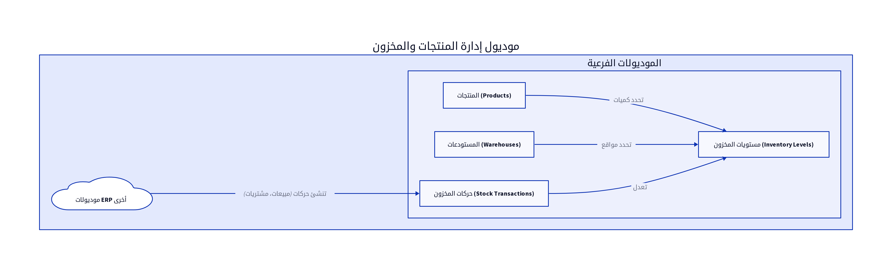

# الباب الخامس: موديول إدارة المنتجات والمخزون (Product and Inventory Management Module)

## 5.1. نظرة عامة على الموديول

يُعد موديول إدارة المنتجات والمخزون (Product and Inventory Management Module) عنصراً حاسماً في أي نظام ERP، حيث يتولى مسؤولية تتبع وإدارة جميع المنتجات والسلع التي تتعامل بها المؤسسة. يهدف هذا الموديول إلى ضمان توفر المنتجات في الوقت المناسب، تحسين مستويات المخزون، وتقليل التكاليف المرتبطة بالتخزين. تشمل الوظائف الرئيسية لهذا الموديول كتالوج المنتجات، التحكم في المخزون، إدارة المستودعات، وتتبع حركات المخزون [2].

## 5.2. تصميم قاعدة البيانات

يركز تصميم قاعدة البيانات لموديول المنتجات والمخزون على التقاط جميع المعلومات المتعلقة بالمنتجات، مستويات المخزون، والمستودعات. فيما يلي المكونات الرئيسية لتصميم قاعدة البيانات:

### 5.2.1. المنتجات (Products)

يخزن هذا الجدول المعلومات الأساسية والتفصيلية لكل منتج أو خدمة تقدمها المؤسسة.

| الحقل (Field) | نوع البيانات (Data Type) | الوصف (Description) |
|---------------|--------------------------|---------------------|
| `product_id`  | `INT (PK)`               | معرف المنتج الفريد |
| `product_name`| `VARCHAR(255)`           | اسم المنتج [10] |
| `sku`         | `VARCHAR(50)`            | رمز تعريف المنتج (Stock Keeping Unit) [10] |
| `description` | `TEXT`                   | وصف المنتج [10] |
| `category_id` | `INT (FK)`               | معرف فئة المنتج [10] |
| `unit_of_measure`| `VARCHAR(50)`            | وحدة القياس (مثال: قطعة، كجم) |
| `cost_price`  | `DECIMAL(18,2)`          | سعر التكلفة [10] |
| `sale_price`  | `DECIMAL(18,2)`          | سعر البيع [10] |
| `reorder_level`| `INT`                    | مستوى إعادة الطلب (عند الوصول إليه يتم طلب كمية جديدة) |
| `is_active`   | `BOOLEAN`                | حالة المنتج (نشط/غير نشط) |

**جدول `ProductCategories`:**

| الحقل (Field) | نوع البيانات (Data Type) | الوصف (Description) |
|---------------|--------------------------|---------------------|
| `category_id` | `INT (PK)`               | معرف الفئة الفريد |
| `category_name`| `VARCHAR(255)`           | اسم الفئة [10] |
| `parent_id`   | `INT (FK)`               | معرف الفئة الأم (للتصنيف الهرمي) |

### 5.2.2. مستويات المخزون (Inventory Levels)

يتتبع هذا الجدول الكمية المتوفرة من كل منتج في كل مستودع.

| الحقل (Field) | نوع البيانات (Data Type) | الوصف (Description) |
|---------------|--------------------------|---------------------|
| `inventory_id`| `INT (PK)`               | معرف المخزون الفريد |
| `product_id`  | `INT (FK)`               | معرف المنتج المرتبط |
| `store_id`    | `INT (FK)`               | معرف المستودع المرتبط [10] |
| `quantity_on_hand`| `DECIMAL(18,2)`          | الكمية المتوفرة حالياً |
| `reserved_quantity`| `DECIMAL(18,2)`          | الكمية المحجوزة (لأوامر المبيعات) |
| `available_quantity`| `DECIMAL(18,2)`          | الكمية المتاحة للبيع |

### 5.2.3. المستودعات (Warehouses)

يخزن هذا الجدول معلومات عن المستودعات المختلفة التي تمتلكها المؤسسة.

| الحقل (Field) | نوع البيانات (Data Type) | الوصف (Description) |
|---------------|--------------------------|---------------------|
| `store_id`    | `INT (PK)`               | معرف المستودع الفريد [10] |
| `store_name`  | `VARCHAR(255)`           | اسم المستودع [10] |
| `location`    | `TEXT`                   | موقع المستودع |
| `is_active`   | `BOOLEAN`                | حالة المستودع (نشط/غير نشط) |

### 5.2.4. حركات المخزون (Stock Transactions)

يسجل هذا الجدول جميع الحركات التي تؤثر على مستويات المخزون، مثل الاستلام، الصرف، التحويل، والتسوية.

| الحقل (Field) | نوع البيانات (Data Type) | الوصف (Description) |
|---------------|--------------------------|---------------------|
| `transaction_id`| `INT (PK)`               | معرف الحركة الفريد |
| `product_id`  | `INT (FK)`               | معرف المنتج المتأثر |
| `store_id`    | `INT (FK)`               | معرف المستودع المتأثر |
| `transaction_type`| `ENUM`                   | نوع الحركة (استلام، صرف، تحويل، تسوية) |
| `quantity`    | `DECIMAL(18,2)`          | الكمية المتأثرة |
| `transaction_date`| `DATETIME`               | تاريخ ووقت الحركة |
| `reference_id`| `INT`                    | معرف المستند المرجعي (مثال: أمر شراء، فاتورة مبيعات) |
| `description` | `TEXT`                   | وصف الحركة |
| `staff_id`    | `INT (FK)`               | معرف الموظف الذي أجرى الحركة |

## 5.3. المنطق البرمجي الأساسي

يتضمن المنطق البرمجي لموديول المنتجات والمخزون مجموعة من العمليات التي تضمن إدارة فعالة ودقيقة للمخزون:

### 5.3.1. تعريف المنتجات وتصنيفها

يتيح النظام للمستخدمين إضافة منتجات جديدة، تحديد خصائصها (مثل SKU، سعر التكلفة، سعر البيع)، وتصنيفها ضمن فئات. يجب أن يدعم النظام أيضاً إدارة المتغيرات للمنتجات (مثل الألوان، الأحجام) [10].

### 5.3.2. تحديث أرصدة المخزون (Stock Updates)

يتم تحديث أرصدة المخزون تلقائياً عند حدوث أي حركة مخزنية. على سبيل المثال، عند استلام بضاعة من مورد، تزداد الكمية المتوفرة. وعند بيع منتج، تنقص الكمية المتوفرة. يجب أن تكون هذه العملية متزامنة ودقيقة لتجنب الأخطاء [10].

### 5.3.3. نقل المخزون بين المستودعات (Inter-warehouse Transfers)

يتيح النظام للمستخدمين نقل المنتجات بين المستودعات المختلفة. يجب أن يتم تسجيل هذه الحركات بدقة لضمان تتبع صحيح لموقع المنتجات [10].

### 5.3.4. تنبيهات انخفاض المخزون (Low Stock Alerts)

يقوم النظام بتوليد تنبيهات تلقائية عندما تصل كمية منتج معين في مستودع إلى مستوى إعادة الطلب المحدد. يساعد هذا في تجنب نقص المخزون وضمان توفر المنتجات بشكل مستمر [10].

### 5.3.5. جرد المخزون (Inventory Audit)

يجب أن يدعم النظام عمليات جرد المخزون الدورية (مثل الجرد الفعلي أو الجرد المستمر) لمطابقة الأرصدة الفعلية مع الأرصدة المسجلة في النظام. يتم تسجيل أي فروقات كتسويات مخزنية [12] [14].

## 5.4. واجهات برمجة التطبيقات (APIs)

تُعد APIs لموديول المنتجات والمخزون ضرورية لتمكين الموديولات الأخرى (مثل المبيعات، المشتريات، نقطة البيع) من الوصول إلى معلومات المنتجات والمخزون وتحديثها.

*   `GET /products`: لاستعراض جميع المنتجات. يمكن أن يدعم فلاتر للبحث حسب الاسم، SKU، الفئة، أو الحالة [10].
*   `GET /products/{id}`: لاستعراض تفاصيل منتج محدد باستخدام معرف المنتج (`product_id`) [10].
*   `POST /products`: لإضافة منتج جديد. يتطلب هذا الـ API بيانات المنتج الأساسية مثل `product_name`, `sku`, `description`, `category_id`, `unit_of_measure`, `cost_price`, `sale_price` [10].
*   `PUT /products/{id}`: لتعديل بيانات منتج موجود. يتطلب معرف المنتج (`product_id`) والبيانات المراد تحديثها [10].
*   `DELETE /products/{id}`: لحذف منتج. يتطلب معرف المنتج (`product_id`). يجب أن يتم التحقق من عدم وجود حركات مخزنية أو فواتير مرتبطة بالمنتج قبل الحذف [10].
*   `GET /stores`: لاستعراض جميع المستودعات [10].
*   `GET /stores/{id}`: لاستعراض تفاصيل مستودع محدد [10].
*   `POST /stock_transactions`: لتسجيل حركة مخزنية جديدة. يتطلب هذا الـ API بيانات الحركة مثل `product_id`, `store_id`, `transaction_type`, `quantity`, `reference_id`, `description`, `staff_id` [10].
*   `GET /stock_transactions`: لاستعراض جميع حركات المخزون [10].

## 5.5. التقارير

يوفر موديول المنتجات والمخزون مجموعة من التقارير التي تساعد في إدارة المخزون وتحسين كفاءة العمليات:

*   **تقييم المخزون (Stock Valuation Report):** يُظهر القيمة الإجمالية للمخزون بناءً على سعر التكلفة أو سعر البيع [6].
*   **دوران المخزون (Inventory Turnover Report):** يُقيس مدى سرعة بيع المخزون واستبداله خلال فترة معينة [6].
*   **تحليل ABC للمخزون (ABC Analysis):** يُصنف المنتجات إلى فئات (A, B, C) بناءً على قيمتها وأهميتها، مما يساعد في تحديد أولويات الإدارة [6].
*   **تقرير حركة المخزون (Stock Movement Report):** يُظهر جميع الحركات التي تمت على منتج معين أو في مستودع معين خلال فترة محددة.
*   **تقرير المنتجات منخفضة المخزون (Low Stock Report):** يُدرج المنتجات التي وصلت كميتها إلى مستوى إعادة الطلب أو أقل.

## المراجع (References)

[1] What Is ERP Architecture? Models, Types, and More [2024] - Spinnaker Support. (2024, August 2). Retrieved from https://www.spinnakersupport.com/blog/2024/08/02/erp-architecture/
[2] 8 Core Components of ERP Systems - NetSuite. (2026, April 7). Retrieved from https://www.netsuite.com/portal/resource/articles/erp/erp-systems-components.shtml
[3] ERP System Architecture Explained in Layman's Terms - Visual South. (2026, January 20). Retrieved from https://www.visualsouth.com/blog/architecture-of-erp
[4] What Is ERP System Architecture? (Benefits, Types & Differ) - Synconics. Retrieved from https://www.synconics.com/erp-architecture
[5] ERP Fundamentals: How Is ERP Built? Architecture Explained - Resulting IT. (2023, January 24). Retrieved from https://www.resulting-it.com/erp-insights-blog/build-erp-project-integration
[6] ERP System: Modules, Integrated Workings, Landscapes, Master ... - LinkedIn. (2025, October 21). Retrieved from https://www.linkedin.com/pulse/erp-system-modules-integrated-workings-landscapes-master-rahul-sharma-kwgxc
[7] Daftra API: Welcome - Daftra API. Retrieved from https://docs.daftara.dev/
[8] Integration using the Application Programming Interface (API) - Daftra. Retrieved from https://docs.daftara.com/en/tutorial/api/
[9] Api V2 Docs - Daftra. Retrieved from https://azmart.daftra.com/api_docs/v2/
[10] Endpoints Structure - Daftra API. Retrieved from https://docs.daftara.dev/1259001m0
[11] API - Daftra Knowledge Base. Retrieved from https://docs.daftara.com/en/category/developers/api-en/
[12] How to Conduct an Effective Inventory Audit: Best Practices - VersaCloud ERP. (2024, October 28). Retrieved from https://www.versaclouderp.com/blog/how-to-conduct-an-effective-inventory-audit-best-practices/
[13] A Guide to ERP Software for Financial Systems | RubinBrown. (2025, January 24). Retrieved from https://www.rubinbrown.com/insights-events/insight-articles/essential-erp-features-for-an-effective-financial-management-system/
[14] A Guide to Inventory Audits: Meaning, Types & Best Practices - QuickDice ERP. (2025, November 8). Retrieved from https://quickdiceerp.com/blog/a-guide-to-inventory-audits-meaning-types-best-practices
[15] ERP Implementation: The 9-Step Guide – Forbes Advisor. (2024, July 9). Retrieved from https://www.forbes.com/advisor/business/erp-implementation/
