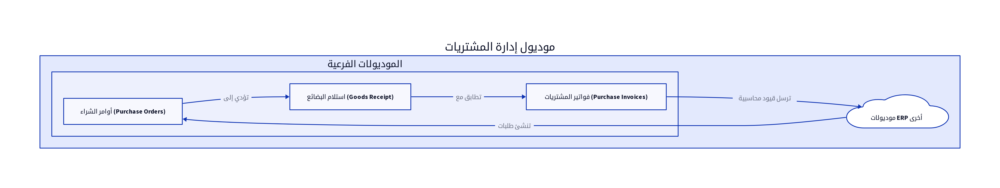

# الباب السادس: موديول إدارة المشتريات (Purchase Management Module)

## 6.1. نظرة عامة على الموديول

يُعد موديول إدارة المشتريات (Purchase Management Module) جزءاً أساسياً من أي نظام ERP، حيث يتولى مسؤولية إدارة جميع العمليات المتعلقة بشراء السلع والخدمات من الموردين. يهدف هذا الموديول إلى تبسيط دورة الشراء، بدءاً من إنشاء طلبات الشراء، مروراً بإصدار أوامر الشراء، استلام البضائع، وحتى معالجة فواتير الموردين. يضمن هذا الموديول كفاءة عمليات الشراء، التحكم في التكاليف، وتحسين العلاقات مع الموردين [2].

## 6.2. تصميم قاعدة البيانات

يركز تصميم قاعدة البيانات لموديول المشتريات على تتبع جميع جوانب عملية الشراء، من معلومات المورد والمنتج إلى تفاصيل أمر الشراء وفاتورة المورد. فيما يلي المكونات الرئيسية لتصميم قاعدة البيانات:

### 6.2.1. أوامر الشراء (Purchase Orders)

تُسجل أوامر الشراء الطلبات الرسمية للمنتجات أو الخدمات من الموردين.

| الحقل (Field) | نوع البيانات (Data Type) | الوصف (Description) |
|---------------|--------------------------|---------------------|
| `po_id`       | `INT (PK)`               | معرف أمر الشراء الفريد |
| `po_number`   | `VARCHAR(50)`            | رقم أمر الشراء (تسلسلي) [10] |
| `supplier_id` | `INT (FK)`               | معرف المورد المرتبط [10] |
| `order_date`  | `DATE`                   | تاريخ الطلب [10] |
| `delivery_date`| `DATE`                   | تاريخ التسليم المتوقع [10] |
| `status`      | `ENUM`                   | حالة الطلب (معلق، معتمد، مستلم جزئياً، مستلم بالكامل) |
| `total_amount`| `DECIMAL(18,2)`          | إجمالي مبلغ الطلب [10] |
| `currency_code`| `VARCHAR(3)`             | رمز العملة [10] |
| `notes`       | `TEXT`                   | ملاحظات إضافية [10] |
| `staff_id`    | `INT (FK)`               | معرف الموظف الذي أنشأ أمر الشراء [10] |

**جدول `PurchaseOrderItems` (بنود أمر الشراء):**

| الحقل (Field) | نوع البيانات (Data Type) | الوصف (Description) |
|---------------|--------------------------|---------------------|
| `item_id`     | `INT (PK)`               | معرف البند الفريد |
| `po_id`       | `INT (FK)`               | معرف أمر الشراء المرتبط |
| `product_id`  | `INT (FK)`               | معرف المنتج المرتبط [10] |
| `item_name`   | `VARCHAR(255)`           | اسم المنتج/الخدمة [10] |
| `description` | `TEXT`                   | وصف البند [10] |
| `quantity`    | `DECIMAL(18,2)`          | الكمية المطلوبة [10] |
| `unit_price`  | `DECIMAL(18,2)`          | سعر الوحدة المتفق عليه [10] |
| `total_price` | `DECIMAL(18,2)`          | إجمالي سعر البند [10] |
| `received_quantity`| `DECIMAL(18,2)`          | الكمية المستلمة حتى الآن |

### 6.2.2. فواتير المشتريات (Purchase Invoices)

تُسجل فواتير المشتريات الفواتير التي يتم استلامها من الموردين مقابل السلع أو الخدمات.

| الحقل (Field) | نوع البيانات (Data Type) | الوصف (Description) |
|---------------|--------------------------|---------------------|
| `purchase_invoice_id`| `INT (PK)`               | معرف فاتورة المشتريات الفريد |
| `invoice_number`| `VARCHAR(50)`            | رقم فاتورة المورد [10] |
| `supplier_id` | `INT (FK)`               | معرف المورد المرتبط [10] |
| `po_id`       | `INT (FK)`               | معرف أمر الشراء المرتبط (إن وجد) [10] |
| `date`        | `DATE`                   | تاريخ الفاتورة [10] |
| `due_date`    | `DATE`                   | تاريخ الاستحقاق [10] |
| `total_amount`| `DECIMAL(18,2)`          | إجمالي مبلغ الفاتورة [10] |
| `tax_amount`  | `DECIMAL(18,2)`          | مبلغ الضريبة [10] |
| `currency_code`| `VARCHAR(3)`             | رمز العملة [10] |
| `status`      | `ENUM`                   | حالة الفاتورة (مدفوعة، مستحقة، جزئية) |

### 6.2.3. استلام البضائع (Goods Receipt)

يتم تسجيل استلام البضائع كحركة مخزنية تؤثر على موديول المخزون، ولكن يمكن أن يكون هناك جدول منفصل لتتبع تفاصيل الاستلام.

| الحقل (Field) | نوع البيانات (Data Type) | الوصف (Description) |
|---------------|--------------------------|---------------------|
| `receipt_id`  | `INT (PK)`               | معرف الاستلام الفريد |
| `po_id`       | `INT (FK)`               | معرف أمر الشراء المرتبط |
| `product_id`  | `INT (FK)`               | معرف المنتج المستلم |
| `quantity`    | `DECIMAL(18,2)`          | الكمية المستلمة |
| `receipt_date`| `DATETIME`               | تاريخ ووقت الاستلام |
| `store_id`    | `INT (FK)`               | معرف المستودع الذي تم الاستلام فيه |

## 6.3. المنطق البرمجي الأساسي

يتضمن المنطق البرمجي لموديول المشتريات مجموعة من العمليات التي تضمن سير دورة الشراء بكفاءة ودقة:

### 6.3.1. إنشاء أوامر الشراء

عند إنشاء أمر شراء، يقوم النظام بالتحقق من معلومات المورد والمنتج، وتطبيق شروط الدفع المتفق عليها. يتم إنشاء قيد محاسبي تلقائي في موديول المالية لتسجيل الذمم الدائنة [10].

### 6.3.2. تسجيل استلام البضائع (Goods Receipt)

عند استلام البضائع من المورد، يتم تسجيل الكميات المستلمة ومطابقتها مع الكميات المطلوبة في أمر الشراء. يتم تحديث أرصدة المخزون في موديول المنتجات والمخزون تلقائياً [10].

### 6.3.3. مطابقة فواتير الموردين بأوامر الشراء (Three-Way Matching)

تُعد عملية المطابقة ثلاثية الأطراف (Three-Way Matching) ممارسة أساسية في إدارة المشتريات. تتضمن مطابقة فاتورة المورد مع أمر الشراء الأصلي وتقرير استلام البضائع. تضمن هذه العملية أن الشركة تدفع فقط مقابل السلع والخدمات التي تم طلبها واستلامها بالفعل [10].

## 6.4. واجهات برمجة التطبيقات (APIs)

تُعد APIs لموديول المشتريات ضرورية لتمكين إنشاء، استعراض، وتعديل أوامر الشراء وفواتير الموردين، بالإضافة إلى التكامل مع أنظمة إدارة المخزون والمحاسبة.

*   `POST /purchase_invoices`: لإنشاء فاتورة مشتريات جديدة. يتطلب هذا الـ API بيانات رأس الفاتورة (مثل `supplier_id`, `invoice_number`, `date`, `due_date`, `total_amount`, `currency_code`) [10].
*   `GET /purchase_invoices`: لاستعراض جميع فواتير المشتريات. يمكن أن يدعم فلاتر للبحث حسب المورد، التاريخ، الحالة، أو رقم الفاتورة [10].
*   `GET /purchase_invoices/{id}`: لاستعراض تفاصيل فاتورة مشتريات محددة باستخدام معرف الفاتورة (`purchase_invoice_id`) [10].
*   `PUT /purchase_invoices/{id}`: لتعديل فاتورة مشتريات موجودة. يتطلب معرف الفاتورة (`purchase_invoice_id`) والبيانات المراد تحديثها [10].
*   `DELETE /purchase_invoices/{id}`: لحذف فاتورة مشتريات. يتطلب معرف الفاتورة (`purchase_invoice_id`). يجب أن يتم التحقق من عدم وجود مدفوعات مرتبطة بالفاتورة قبل الحذف [10].
*   `POST /purchase_orders`: لإنشاء أمر شراء جديد. يتطلب هذا الـ API بيانات رأس أمر الشراء (مثل `supplier_id`, `po_number`, `order_date`, `delivery_date`, `total_amount`, `currency_code`) وبنود أمر الشراء (مثل `product_id`, `quantity`, `unit_price`) [10].
*   `GET /purchase_orders`: لاستعراض جميع أوامر الشراء [10].

## 6.5. التقارير

يوفر موديول المشتريات مجموعة من التقارير التحليلية التي تساعد في تقييم أداء المشتريات وتتبع الذمم الدائنة:

*   **مشتريات حسب المورد (Purchases by Supplier):** يُظهر إجمالي المشتريات من كل مورد خلال فترة محددة [6].
*   **مشتريات حسب المنتج (Purchases by Product):** يُظهر المنتجات الأكثر شراءً والأقل شراءً، مما يساعد في إدارة المخزون والتفاوض مع الموردين [6].
*   **تحليل أعمار فواتير الموردين (Supplier Invoice Aging):** يُصنف فواتير الموردين المستحقة بناءً على مدة استحقاقها، مما يساعد في إدارة المدفوعات [6].
*   **تقرير أداء الموردين (Supplier Performance Report):** يُقيم أداء الموردين بناءً على معايير مثل جودة المنتجات، الالتزام بمواعيد التسليم، والأسعار.

## المراجع (References)

[1] What Is ERP Architecture? Models, Types, and More [2024] - Spinnaker Support. (2024, August 2). Retrieved from https://www.spinnakersupport.com/blog/2024/08/02/erp-architecture/
[2] 8 Core Components of ERP Systems - NetSuite. (2026, April 7). Retrieved from https://www.netsuite.com/portal/resource/articles/erp/erp-systems-components.shtml
[3] ERP System Architecture Explained in Layman's Terms - Visual South. (2026, January 20). Retrieved from https://www.visualsouth.com/blog/architecture-of-erp
[4] What Is ERP System Architecture? (Benefits, Types & Differ) - Synconics. Retrieved from https://www.synconics.com/erp-architecture
[5] ERP Fundamentals: How Is ERP Built? Architecture Explained - Resulting IT. (2023, January 24). Retrieved from https://www.resulting-it.com/erp-insights-blog/build-erp-project-integration
[6] ERP System: Modules, Integrated Workings, Landscapes, Master ... - LinkedIn. (2025, October 21). Retrieved from https://www.linkedin.com/pulse/erp-system-modules-integrated-workings-landscapes-master-rahul-sharma-kwgxc
[7] Daftra API: Welcome - Daftra API. Retrieved from https://docs.daftara.dev/
[8] Integration using the Application Programming Interface (API) - Daftra. Retrieved from https://docs.daftara.com/en/tutorial/api/
[9] Api V2 Docs - Daftra. Retrieved from https://azmart.daftra.com/api_docs/v2/
[10] Endpoints Structure - Daftra API. Retrieved from https://docs.daftara.dev/1259001m0
[11] API - Daftra Knowledge Base. Retrieved from https://docs.daftara.com/en/category/developers/api-en/
[12] How to Conduct an Effective Inventory Audit: Best Practices - VersaCloud ERP. (2024, October 28). Retrieved from https://www.versaclouderp.com/blog/how-to-conduct-an-effective-inventory-audit-best-practices/
[13] A Guide to ERP Software for Financial Systems | RubinBrown. (2025, January 24). Retrieved from https://www.rubinbrown.com/insights-events/insight-articles/essential-erp-features-for-an-effective-financial-management-system/
[14] A Guide to Inventory Audits: Meaning, Types & Best Practices - QuickDice ERP. (2025, November 8). Retrieved from https://quickdiceerp.com/blog/a-guide-to-inventory-audits-meaning-types-best-practices
[15] ERP Implementation: The 9-Step Guide – Forbes Advisor. (2024, July 9). Retrieved from https://www.forbes.com/advisor/business/erp-implementation/
