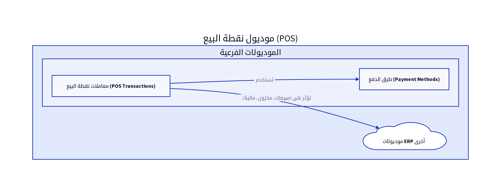

# الباب السابع: موديول نقطة البيع (Point of Sale - POS Module)

## 7.1. نظرة عامة على الموديول

يُعد موديول نقطة البيع (POS Module) واجهة أساسية للشركات التي تتعامل مع المبيعات المباشرة للعملاء، مثل متاجر التجزئة، المطاعم، والمقاهي. يهدف هذا الموديول إلى تبسيط عملية البيع بالتجزئة، من تسجيل المنتجات، معالجة المدفوعات، وحتى إصدار الإيصالات. يتكامل موديول POS بشكل وثيق مع موديولات المبيعات، المخزون، والمالية لضمان تحديث البيانات في الوقت الفعلي وتوفير رؤية شاملة لعمليات البيع [2].

## 7.2. تصميم قاعدة البيانات

يركز تصميم قاعدة البيانات لموديول نقطة البيع على تتبع معاملات البيع السريع، تفاصيل الإيصالات، وطرق الدفع. فيما يلي المكونات الرئيسية لتصميم قاعدة البيانات:

### 7.2.1. معاملات نقطة البيع (POS Transactions)

تُسجل هذه المعاملات كل عملية بيع تتم عبر نقطة البيع.

| الحقل (Field) | نوع البيانات (Data Type) | الوصف (Description) |
|---------------|--------------------------|---------------------|
| `pos_transaction_id`| `INT (PK)`               | معرف معاملة نقطة البيع الفريد |
| `transaction_date`| `DATETIME`               | تاريخ ووقت المعاملة |
| `store_id`    | `INT (FK)`               | معرف المتجر/المستودع الذي تمت فيه المعاملة |
| `staff_id`    | `INT (FK)`               | معرف الموظف الذي أجرى المعاملة |
| `client_id`   | `INT (FK)`               | معرف العميل (إن وجد) |
| `total_amount`| `DECIMAL(18,2)`          | إجمالي مبلغ المعاملة |
| `tax_amount`  | `DECIMAL(18,2)`          | مبلغ الضريبة |
| `discount_amount`| `DECIMAL(18,2)`          | مبلغ الخصم |
| `payment_method_id`| `INT (FK)`               | معرف طريقة الدفع المستخدمة |
| `status`      | `ENUM`                   | حالة المعاملة (مكتملة، معلقة، ملغاة) |

**جدول `POSTransactionItems` (بنود معاملة نقطة البيع):**

| الحقل (Field) | نوع البيانات (Data Type) | الوصف (Description) |
|---------------|--------------------------|---------------------|
| `item_id`     | `INT (PK)`               | معرف البند الفريد |
| `pos_transaction_id`| `INT (FK)`               | معرف معاملة نقطة البيع المرتبطة |
| `product_id`  | `INT (FK)`               | معرف المنتج المرتبط |
| `item_name`   | `VARCHAR(255)`           | اسم المنتج/الخدمة |
| `quantity`    | `DECIMAL(18,2)`          | الكمية المباعة |
| `unit_price`  | `DECIMAL(18,2)`          | سعر الوحدة |
| `total_price` | `DECIMAL(18,2)`          | إجمالي سعر البند |

### 7.2.2. طرق الدفع (Payment Methods)

يخزن هذا الجدول طرق الدفع المختلفة التي يمكن استخدامها في نقطة البيع.

| الحقل (Field) | نوع البيانات (Data Type) | الوصف (Description) |
|---------------|--------------------------|---------------------|
| `payment_method_id`| `INT (PK)`               | معرف طريقة الدفع الفريد |
| `method_name` | `VARCHAR(100)`           | اسم طريقة الدفع (مثال: نقداً، بطاقة ائتمان، مدى) |
| `is_active`   | `BOOLEAN`                | حالة طريقة الدفع (نشط/غير نشط) |

## 7.3. المنطق البرمجي الأساسي

يتضمن المنطق البرمجي لموديول نقطة البيع مجموعة من العمليات التي تضمن سير عملية البيع بسلاسة وسرعة:

### 7.3.1. معالجة المبيعات في الوقت الفعلي

عند إضافة منتج إلى سلة المشتريات، يقوم النظام بالتحقق من توفره في المخزون وتحديث الكميات المتاحة. عند إتمام عملية البيع، يتم خصم الكميات المباعة من المخزون وتحديث السجلات المالية في الوقت الفعلي [10].

### 7.3.2. تكامل مع أجهزة الدفع (Payment Gateway Integration)

يتكامل موديول POS مع بوابات الدفع الإلكترونية (مثل Stripe, PayPal) أو أجهزة نقاط البيع (POS Terminals) لمعالجة المدفوعات ببطاقات الائتمان أو الخصم. يجب أن يضمن هذا التكامل أمان المعاملات وسرعتها.

### 7.3.3. توليد الإيصالات (Receipt Generation)

بعد إتمام عملية البيع، يقوم النظام بتوليد إيصال (Receipt) للعميل، والذي يمكن طباعته أو إرساله عبر البريد الإلكتروني. يجب أن يتضمن الإيصال تفاصيل المعاملة، المنتجات المباعة، المبلغ الإجمالي، وطريقة الدفع.

### 7.3.4. إدارة المرتجعات (Returns Management)

يجب أن يدعم الموديول عملية إرجاع المنتجات، حيث يتم تحديث المخزون والسجلات المالية بشكل صحيح عند قبول المرتجعات.

## 7.4. واجهات برمجة التطبيقات (APIs)

يتكامل موديول POS بشكل أساسي مع APIs الموديولات الأخرى بدلاً من امتلاك APIs خاصة به لعمليات البيع الأساسية. ومع ذلك، قد تكون هناك APIs لإدارة إعدادات نقطة البيع أو استعراض ملخصات المبيعات.

*   **التكامل مع موديول المبيعات:** يستخدم APIs مثل `POST /invoices` لإنشاء فواتير مبيعات للمعاملات الكبيرة أو التي تتطلب تتبعاً مفصلاً [10].
*   **التكامل مع موديول المخزون:** يستخدم APIs مثل `POST /stock_transactions` لتحديث أرصدة المخزون عند البيع أو الإرجاع [10].
*   **التكامل مع موديول المالية:** يقوم بتوليد قيود يومية تلقائية لتسجيل الإيرادات والمدفوعات النقدية أو البنكية [10].

## 7.5. التقارير

يوفر موديول نقطة البيع مجموعة من التقارير التي تساعد في تحليل أداء المبيعات اليومي:

*   **ملخص المبيعات اليومية (Daily Sales Summary):** يُظهر إجمالي المبيعات، الضرائب، الخصومات، والمدفوعات لكل يوم عمل [6].
*   **مبيعات حسب طريقة الدفع (Sales by Payment Method):** يُوضح توزيع المبيعات على طرق الدفع المختلفة (نقداً، بطاقة، إلخ) [6].
*   **تقرير المنتجات المباعة (Products Sold Report):** يُدرج المنتجات الأكثر مبيعاً خلال فترة محددة.
*   **تقرير الموظفين (Staff Performance Report):** يُقيم أداء الموظفين في نقطة البيع بناءً على حجم المبيعات.

## المراجع (References)

[1] What Is ERP Architecture? Models, Types, and More [2024] - Spinnaker Support. (2024, August 2). Retrieved from https://www.spinnakersupport.com/blog/2024/08/02/erp-architecture/
[2] 8 Core Components of ERP Systems - NetSuite. (2026, April 7). Retrieved from https://www.netsuite.com/portal/resource/articles/erp/erp-systems-components.shtml
[3] ERP System Architecture Explained in Layman's Terms - Visual South. (2026, January 20). Retrieved from https://www.visualsouth.com/blog/architecture-of-erp
[4] What Is ERP System Architecture? (Benefits, Types & Differ) - Synconics. Retrieved from https://www.synconics.com/erp-architecture
[5] ERP Fundamentals: How Is ERP Built? Architecture Explained - Resulting IT. (2023, January 24). Retrieved from https://www.resulting-it.com/erp-insights-blog/build-erp-project-integration
[6] ERP System: Modules, Integrated Workings, Landscapes, Master ... - LinkedIn. (2025, October 21). Retrieved from https://www.linkedin.com/pulse/erp-system-modules-integrated-workings-landscapes-master-rahul-sharma-kwgxc
[7] Daftra API: Welcome - Daftra API. Retrieved from https://docs.daftara.dev/
[8] Integration using the Application Programming Interface (API) - Daftra. Retrieved from https://docs.daftara.com/en/tutorial/api/
[9] Api V2 Docs - Daftra. Retrieved from https://azmart.daftra.com/api_docs/v2/
[10] Endpoints Structure - Daftra API. Retrieved from https://docs.daftara.dev/1259001m0
[11] API - Daftra Knowledge Base. Retrieved from https://docs.daftara.com/en/category/developers/api-en/
[12] How to Conduct an Effective Inventory Audit: Best Practices - VersaCloud ERP. (2024, October 28). Retrieved from https://www.versaclouderp.com/blog/how-to-conduct-an-effective-inventory-audit-best-practices/
[13] A Guide to ERP Software for Financial Systems | RubinBrown. (2025, January 24). Retrieved from https://www.rubinbrown.com/insights-events/insight-articles/essential-erp-features-for-an-effective-financial-management-system/
[14] A Guide to Inventory Audits: Meaning, Types & Best Practices - QuickDice ERP. (2025, November 8). Retrieved from https://quickdiceerp.com/blog/a-guide-to-inventory-audits-meaning-types-best-practices
[15] ERP Implementation: The 9-Step Guide – Forbes Advisor. (2024, July 9). Retrieved from https://www.forbes.com/advisor/business/erp-implementation/
