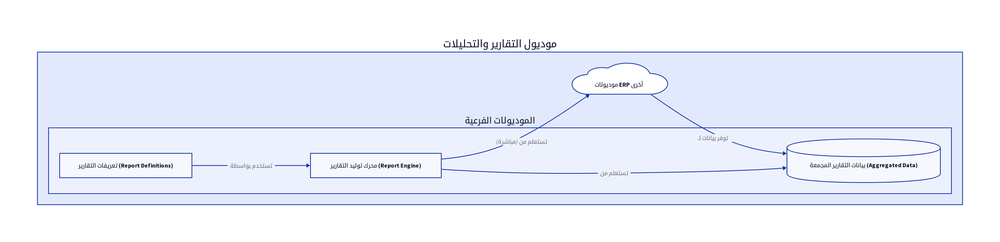

# الباب الثامن: موديول التقارير والتحليلات (Reports and Analytics Module)

## 8.1. نظرة عامة على الموديول

يُعد موديول التقارير والتحليلات (Reports and Analytics Module) أداة حيوية في أي نظام ERP، حيث يوفر للمؤسسة القدرة على استخراج، تحليل، وعرض البيانات من جميع الموديولات الأخرى. يهدف هذا الموديول إلى تحويل البيانات الخام إلى معلومات قابلة للاستخدام، مما يدعم اتخاذ القرارات الاستراتيجية والتشغيلية. تشمل الوظائف الرئيسية لهذا الموديول توليد التقارير المالية، التشغيلية، المخزنية، بالإضافة إلى لوحات المعلومات التفاعلية (Dashboards) [6].

## 8.2. تصميم قاعدة البيانات

يعتمد تصميم قاعدة البيانات لموديول التقارير والتحليلات على تجميع البيانات من الموديولات الأخرى، وقد يتضمن جداول مخصصة لتخزين البيانات المجمعة أو تعريفات التقارير. فيما يلي المكونات الرئيسية لتصميم قاعدة البيانات:

### 8.2.1. بيانات التقارير المجمعة (Aggregated Report Data)

في بعض الحالات، خاصة للتقارير المعقدة أو التي تتطلب أداءً عالياً، قد يتم إنشاء جداول مخصصة لتخزين البيانات المجمعة أو المحسوبة مسبقاً. هذا يقلل من الحمل على قاعدة البيانات التشغيلية ويحسن سرعة توليد التقارير.

| الحقل (Field) | نوع البيانات (Data Type) | الوصف (Description) |
|---------------|--------------------------|---------------------|
| `report_data_id`| `INT (PK)`               | معرف البيانات المجمعة الفريد |
| `report_type` | `VARCHAR(100)`           | نوع التقرير (مثال: مبيعات شهرية) |
| `period_start_date`| `DATE`                   | تاريخ بداية الفترة |
| `period_end_date`| `DATE`                   | تاريخ نهاية الفترة |
| `total_sales` | `DECIMAL(18,2)`          | إجمالي المبيعات للفترة |
| `total_profit`| `DECIMAL(18,2)`          | إجمالي الأرباح للفترة |
| `product_id`  | `INT (FK)`               | معرف المنتج (إن كان التقرير خاصاً بمنتج) |

### 8.2.2. تعريفات التقارير (Report Definitions)

يسمح هذا الجدول بتخزين إعدادات التقارير المخصصة التي ينشئها المستخدمون، مما يتيح لهم حفظ قوالب التقارير وإعادة استخدامها.

| الحقل (Field) | نوع البيانات (Data Type) | الوصف (Description) |
|---------------|--------------------------|---------------------|
| `report_def_id`| `INT (PK)`               | معرف تعريف التقرير الفريد |
| `report_name` | `VARCHAR(255)`           | اسم التقرير |
| `report_description`| `TEXT`                   | وصف التقرير |
| `query_sql`   | `TEXT`                   | استعلام SQL المستخدم لتوليد التقرير |
| `parameters`  | `JSON`                   | معلمات التقرير (مثل نطاق التاريخ، الفلاتر) |
| `created_by`  | `INT (FK)`               | معرف المستخدم الذي أنشأ التقرير |
| `created_date`| `DATETIME`               | تاريخ إنشاء التقرير |

## 8.3. المنطق البرمجي الأساسي

يتضمن المنطق البرمجي لموديول التقارير والتحليلات مجموعة من العمليات التي تضمن توليد تقارير دقيقة وذات مغزى:

### 8.3.1. محركات توليد التقارير (Report Generation Engines)

يجب أن يحتوي النظام على محركات قوية لتوليد التقارير، قادرة على استعلام قواعد البيانات، تجميع البيانات، وتطبيق الفلاتر والفرز. يمكن أن تكون هذه المحركات مبنية على SQL مباشرة أو تستخدم أدوات ETL (Extract, Transform, Load) لمعالجة البيانات قبل توليد التقرير [6].

### 8.3.2. تجميع البيانات وتحليلها (Data Aggregation and Analysis)

يقوم النظام بتجميع البيانات من موديولات مختلفة (مثل المالية، المبيعات، المخزون) وتحليلها لتقديم رؤى شاملة. يمكن أن يشمل ذلك حساب المجاميع، المتوسطات، النسب المئوية، والاتجاهات [6].

### 8.3.3. تخصيص التقارير (Custom Report Builder)

يجب أن يوفر الموديول واجهة للمستخدمين لإنشاء تقارير مخصصة بناءً على احتياجاتهم. يمكن أن يتضمن ذلك اختيار الحقول، تطبيق الفلاتر، تحديد نطاقات التاريخ، وتنسيق العرض [6].

## 8.4. واجهات برمجة التطبيقات (APIs)

تُعد APIs لموديول التقارير والتحليلات ضرورية لتمكين الموديولات الأخرى من طلب التقارير، أو لتكامل النظام مع أدوات ذكاء الأعمال الخارجية.

*   `GET /reports/financial`: لاستعراض التقارير المالية (مثل قائمة الدخل، الميزانية العمومية). يمكن أن يدعم معلمات مثل `start_date`, `end_date` [10].
*   `GET /reports/sales`: لاستعراض تقارير المبيعات (مثل مبيعات حسب العميل، مبيعات حسب المنتج). يمكن أن يدعم معلمات مثل `client_id`, `product_id`, `start_date`, `end_date` [10].
*   `GET /reports/inventory`: لاستعراض تقارير المخزون (مثل تقييم المخزون، دوران المخزون). يمكن أن يدعم معلمات مثل `store_id`, `product_id` [10].
*   `POST /reports/custom`: لإنشاء تقرير مخصص بناءً على تعريف تقرير محدد أو معلمات مقدمة [10].

## 8.5. أنواع التقارير

يوفر موديول التقارير والتحليلات مجموعة واسعة من التقارير لتلبية احتياجات الأقسام المختلفة:

*   **التقارير المالية (Financial Reports):** تشمل قائمة الدخل، الميزانية العمومية، قائمة التدفقات النقدية، وميزان المراجعة [13].
*   **تقارير المبيعات والمشتريات (Sales and Purchase Reports):** تشمل مبيعات حسب العميل، مبيعات حسب المنتج، مشتريات حسب المورد، وتحليل أعمار الفواتير [6].
*   **تقارير المخزون (Inventory Reports):** تشمل تقييم المخزون، دوران المخزون، تحليل ABC، وتقرير حركة المخزون [6].
*   **لوحات المعلومات التفاعلية (Interactive Dashboards):** تُقدم نظرة عامة مرئية على مؤشرات الأداء الرئيسية (KPIs) للشركة، مع إمكانية التفاعل مع البيانات وتصفيتها [6].

## المراجع (References)

[1] What Is ERP Architecture? Models, Types, and More [2024] - Spinnaker Support. (2024, August 2). Retrieved from https://www.spinnakersupport.com/blog/2024/08/02/erp-architecture/
[2] 8 Core Components of ERP Systems - NetSuite. (2026, April 7). Retrieved from https://www.netsuite.com/portal/resource/articles/erp/erp-systems-components.shtml
[3] ERP System Architecture Explained in Layman\'s Terms - Visual South. (2026, January 20). Retrieved from https://www.visualsouth.com/blog/architecture-of-erp
[4] What Is ERP System Architecture? (Benefits, Types & Differ) - Synconics. Retrieved from https://www.synconics.com/erp-architecture
[5] ERP Fundamentals: How Is ERP Built? Architecture Explained - Resulting IT. (2023, January 24). Retrieved from https://www.resulting-it.com/erp-insights-blog/build-erp-project-integration
[6] ERP System: Modules, Integrated Workings, Landscapes, Master ... - LinkedIn. (2025, October 21). Retrieved from https://www.linkedin.com/pulse/erp-system-modules-integrated-workings-landscapes-master-rahul-sharma-kwgxc
[7] Daftra API: Welcome - Daftra API. Retrieved from https://docs.daftara.dev/
[8] Integration using the Application Programming Interface (API) - Daftra. Retrieved from https://docs.daftara.com/en/tutorial/api/
[9] Api V2 Docs - Daftra. Retrieved from https://azmart.daftra.com/api_docs/v2/
[10] Endpoints Structure - Daftra API. Retrieved from https://docs.daftara.dev/1259001m0
[11] API - Daftra Knowledge Base. Retrieved from https://docs.daftara.com/en/category/developers/api-en/
[12] How to Conduct an Effective Inventory Audit: Best Practices - VersaCloud ERP. (2024, October 28). Retrieved from https://www.versaclouderp.com/blog/how-to-conduct-an-effective-inventory-audit-best-practices/
[13] A Guide to ERP Software for Financial Systems | RubinBrown. (2025, January 24). Retrieved from https://www.rubinbrown.com/insights-events/insight-articles/essential-erp-features-for-an-effective-financial-management-system/
[14] A Guide to Inventory Audits: Meaning, Types & Best Practices - QuickDice ERP. (2025, November 8). Retrieved from https://quickdiceerp.com/blog/a-guide-to-inventory-audits-meaning-types-best-practices
[15] ERP Implementation: The 9-Step Guide – Forbes Advisor. (2024, July 9). Retrieved from https://www.forbes.com/advisor/business/erp-implementation/
