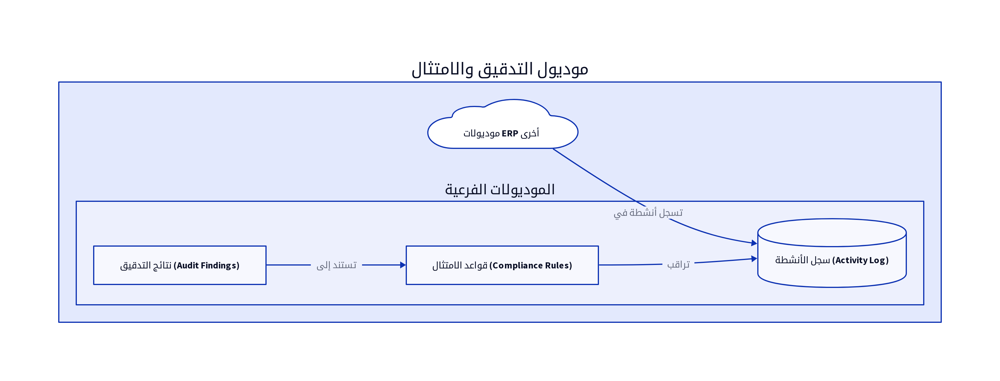

# الباب التاسع: موديول التدقيق والامتثال (Audit and Compliance Module)

## 9.1. نظرة عامة على الموديول

يُعد موديول التدقيق والامتثال (Audit and Compliance Module) ضرورياً لضمان الشفافية، المساءلة، والالتزام باللوائح الداخلية والخارجية داخل نظام ERP. يهدف هذا الموديول إلى تتبع جميع الأنشطة الهامة التي تتم داخل النظام، وتسجيلها في سجلات تدقيق مفصلة، ومراقبة الامتثال للسياسات والإجراءات. يساعد هذا الموديول المؤسسات على تحديد المخاطر، التحقيق في الحوادث، وتقديم الأدلة اللازمة لعمليات التدقيق الخارجية [12].

## 9.2. تصميم قاعدة البيانات

يركز تصميم قاعدة البيانات لموديول التدقيق والامتثال على تسجيل تفاصيل الأنشطة وسجلات التدقيق، بالإضافة إلى تتبع نتائج التدقيق. فيما يلي المكونات الرئيسية لتصميم قاعدة البيانات:

### 9.2.1. سجل الأنشطة (Activity Log)

يسجل هذا الجدول جميع الإجراءات الهامة التي تتم داخل النظام، مما يوفر مسار تدقيق كاملاً.

| الحقل (Field) | نوع البيانات (Data Type) | الوصف (Description) |
|---------------|--------------------------|---------------------|
| `log_id`      | `INT (PK)`               | معرف السجل الفريد |
| `timestamp`   | `DATETIME`               | تاريخ ووقت الإجراء |
| `staff_id`    | `INT (FK)`               | معرف الموظف الذي قام بالإجراء |
| `action_type` | `VARCHAR(100)`           | نوع الإجراء (مثال: إنشاء، تعديل، حذف، تسجيل دخول) |
| `module_name` | `VARCHAR(100)`           | الموديول الذي تم فيه الإجراء |
| `entity_type` | `VARCHAR(100)`           | نوع الكيان المتأثر (مثال: فاتورة، منتج، عميل) |
| `entity_id`   | `INT`                    | معرف الكيان المتأثر |
| `old_value`   | `JSON`                   | القيمة القديمة للبيانات (قبل التعديل) |
| `new_value`   | `JSON`                   | القيمة الجديدة للبيانات (بعد التعديل) |
| `ip_address`  | `VARCHAR(45)`            | عنوان IP للمستخدم |

### 9.2.2. نتائج التدقيق (Audit Findings)

يخزن هذا الجدول نتائج عمليات التدقيق، بما في ذلك أي ملاحظات، توصيات، أو انتهاكات تم اكتشافها.

| الحقل (Field) | نوع البيانات (Data Type) | الوصف (Description) |
|---------------|--------------------------|---------------------|
| `finding_id`  | `INT (PK)`               | معرف نتيجة التدقيق الفريد |
| `audit_date`  | `DATE`                   | تاريخ عملية التدقيق |
| `description` | `TEXT`                   | وصف تفصيلي لنتيجة التدقيق |
| `severity`    | `ENUM`                   | مستوى الخطورة (منخفض، متوسط، مرتفع) |
| `status`      | `ENUM`                   | حالة النتيجة (مفتوحة، قيد المعالجة، مغلقة) |
| `assigned_to` | `INT (FK)`               | معرف الموظف المسؤول عن معالجة النتيجة |
| `due_date`    | `DATE`                   | تاريخ الاستحقاق لمعالجة النتيجة |
| `resolution_details`| `TEXT`                   | تفاصيل الحل أو الإجراء التصحيحي |

## 9.3. المنطق البرمجي الأساسي

يتضمن المنطق البرمجي لموديول التدقيق والامتثال مجموعة من العمليات التي تضمن تتبعاً دقيقاً للأنشطة ومراقبة فعالة للامتثال:

### 9.3.1. تسجيل جميع الإجراءات الهامة على النظام

يجب أن يقوم النظام بتسجيل جميع الإجراءات التي قد تكون ذات أهمية للتدقيق، مثل إنشاء، تعديل، أو حذف السجلات المالية، أو تغيير صلاحيات المستخدمين. يتم تسجيل هذه الإجراءات تلقائياً في جدول `AuditLogs` مع جميع التفاصيل ذات الصلة [12].

### 9.3.2. تحليل سجلات التدقيق لتحديد الأنماط المشبوهة

يمكن للموديول استخدام خوارزميات تحليل البيانات لتحديد الأنماط المشبوهة أو غير المعتادة في سجلات التدقيق، مثل محاولات تسجيل الدخول الفاشلة المتكررة، أو التعديلات على البيانات الحساسة من قبل مستخدمين غير مصرح لهم. يمكن أن يؤدي ذلك إلى توليد تنبيهات تلقائية للمسؤولين [12].

### 9.3.3. إدارة دورة حياة نتائج التدقيق (Finding Lifecycle Management)

يتيح الموديول للمستخدمين تسجيل نتائج التدقيق، وتعيينها للموظفين المسؤولين، وتتبع حالتها من الاكتشاف وحتى الحل. يجب أن يدعم النظام أيضاً إرفاق المستندات والأدلة المتعلقة بكل نتيجة تدقيق [12].

## 9.4. واجهات برمجة التطبيقات (APIs)

تُعد APIs لموديول التدقيق والامتثال ضرورية لتمكين الموديولات الأخرى من تسجيل الأنشطة، وللسماح للمدققين بالوصول إلى سجلات التدقيق ونتائجه.

*   `POST /audit_logs`: لتسجيل نشاط جديد في سجل التدقيق. يتم استدعاء هذا الـ API تلقائياً من قبل الموديولات الأخرى عند حدوث إجراء هام [10].
*   `GET /audit_logs`: لاستعراض سجلات التدقيق. يمكن أن يدعم فلاتر للبحث حسب الموظف، نوع الإجراء، الموديول، أو نطاق التاريخ [10].
*   `POST /audit_findings`: لتسجيل نتيجة تدقيق جديدة. يتطلب هذا الـ API بيانات النتيجة مثل `audit_date`, `description`, `severity`, `status`, `assigned_to`, `due_date` [10].
*   `GET /audit_findings`: لاستعراض نتائج التدقيق. يمكن أن يدعم فلاتر للبحث حسب الحالة، مستوى الخطورة، أو الموظف المسؤول [10].
*   `PUT /audit_findings/{id}`: لتحديث حالة أو تفاصيل نتيجة تدقيق موجودة [10].

## 9.5. التقارير

يوفر موديول التدقيق والامتثال مجموعة من التقارير التي تساعد في مراقبة الامتثال وتقييم الأمان:

*   **تقرير سجل الأنشطة (Activity Log Report):** يُظهر جميع الأنشطة التي تمت في النظام خلال فترة محددة، مع تفاصيل عن المستخدم، الإجراء، والكيان المتأثر [6].
*   **تقرير حالة الامتثال (Compliance Status Report):** يُقدم نظرة عامة على مدى التزام الشركة بالسياسات والإجراءات، ويُظهر أي انتهاكات تم اكتشافها [6].
*   **تقرير نتائج التدقيق (Audit Findings Report):** يُدرج جميع نتائج التدقيق، حالتها، ومستوى خطورتها، مع تفاصيل عن الإجراءات التصحيحية المتخذة [6].
*   **تقرير المستخدمين النشطين (Active Users Report):** يُظهر قائمة بالمستخدمين الذين قاموا بتسجيل الدخول والأنشطة التي قاموا بها.

## المراجع (References)

[1] What Is ERP Architecture? Models, Types, and More [2024] - Spinnaker Support. (2024, August 2). Retrieved from https://www.spinnakersupport.com/blog/2024/08/02/erp-architecture/
[2] 8 Core Components of ERP Systems - NetSuite. (2026, April 7). Retrieved from https://www.netsuite.com/portal/resource/articles/erp/erp-systems-components.shtml
[3] ERP System Architecture Explained in Layman\'s Terms - Visual South. (2026, January 20). Retrieved from https://www.visualsouth.com/blog/architecture-of-erp
[4] What Is ERP System Architecture? (Benefits, Types & Differ) - Synconics. Retrieved from https://www.synconics.com/erp-architecture
[5] ERP Fundamentals: How Is ERP Built? Architecture Explained - Resulting IT. (2023, January 24). Retrieved from https://www.resulting-it.com/erp-insights-blog/build-erp-project-integration
[6] ERP System: Modules, Integrated Workings, Landscapes, Master ... - LinkedIn. (2025, October 21). Retrieved from https://www.linkedin.com/pulse/erp-system-modules-integrated-workings-landscapes-master-rahul-sharma-kwgxc
[7] Daftra API: Welcome - Daftra API. Retrieved from https://docs.daftara.dev/
[8] Integration using the Application Programming Interface (API) - Daftra. Retrieved from https://docs.daftara.com/en/tutorial/api/
[9] Api V2 Docs - Daftra. Retrieved from https://azmart.daftra.com/api_docs/v2/
[10] Endpoints Structure - Daftra API. Retrieved from https://docs.daftara.dev/1259001m0
[11] API - Daftra Knowledge Base. Retrieved from https://docs.daftara.com/en/category/developers/api-en/
[12] How to Conduct an Effective Inventory Audit: Best Practices - VersaCloud ERP. (2024, October 28). Retrieved from https://www.versaclouderp.com/blog/how-to-conduct-an-effective-inventory-audit-best-practices/
[13] A Guide to ERP Software for Financial Systems | RubinBrown. (2025, January 24). Retrieved from https://www.rubinbrown.com/insights-events/insight-articles/essential-erp-features-for-an-effective-financial-management-system/
[14] A Guide to Inventory Audits: Meaning, Types & Best Practices - QuickDice ERP. (2025, November 8). Retrieved from https://quickdiceerp.com/blog/a-guide-to-inventory-audits-meaning-types-best-practices
[15] ERP Implementation: The 9-Step Guide – Forbes Advisor. (2024, July 9). Retrieved from https://www.forbes.com/advisor/business/erp-implementation/
