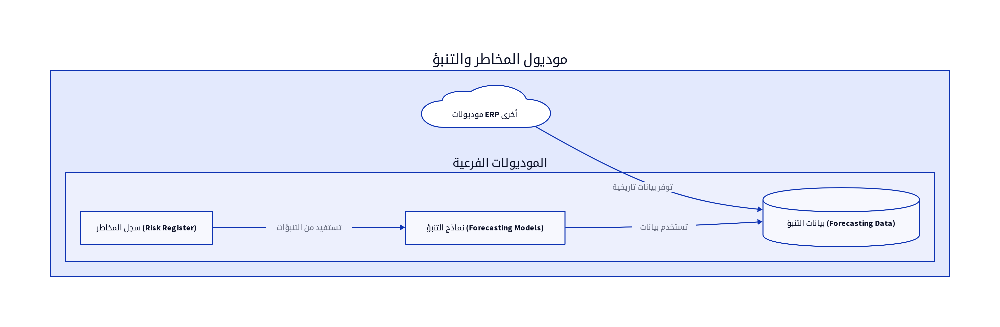

# الباب العاشر: موديول المخاطر والتنبؤ (Risk and Forecasting Module)

## 10.1. نظرة عامة على الموديول

يُعد موديول المخاطر والتنبؤ (Risk and Forecasting Module) أداة استراتيجية في نظام ERP، حيث يوفر للمؤسسة القدرة على تحديد، تقييم، ومراقبة المخاطر المحتملة، بالإضافة إلى التنبؤ بالاتجاهات المستقبلية بناءً على البيانات التاريخية. يهدف هذا الموديول إلى دعم اتخاذ القرارات الاستباقية، تقليل عدم اليقين، وتحسين التخطيط للمستقبل. تشمل الوظائف الرئيسية لهذا الموديول تقييم المخاطر، التنبؤ بالاتجاهات، ومؤشرات المخاطر الرئيسية [6].

## 10.2. تصميم قاعدة البيانات

يركز تصميم قاعدة البيانات لموديول المخاطر والتنبؤ على تخزين معلومات المخاطر، والبيانات التاريخية المستخدمة في التنبؤات، ونتائج نماذج التنبؤ. فيما يلي المكونات الرئيسية لتصميم قاعدة البيانات:

### 10.2.1. سجل المخاطر (Risk Register)

يسجل هذا الجدول جميع المخاطر المحتملة التي قد تواجه المؤسسة، مع تفاصيل عن طبيعة المخاطرة، احتمالية حدوثها، وتأثيرها المحتمل.

| الحقل (Field) | نوع البيانات (Data Type) | الوصف (Description) |
|---------------|--------------------------|---------------------|
| `risk_id`     | `INT (PK)`               | معرف المخاطرة الفريد |
| `risk_name`   | `VARCHAR(255)`           | اسم المخاطرة |
| `description` | `TEXT`                   | وصف تفصيلي للمخاطرة |
| `category`    | `ENUM`                   | فئة المخاطرة (مثال: مالية، تشغيلية، استراتيجية) |
| `probability` | `DECIMAL(5,2)`           | احتمالية الحدوث (0-1) |
| `impact`      | `DECIMAL(5,2)`           | التأثير المحتمل (0-1) |
| `risk_score`  | `DECIMAL(5,2)`           | درجة المخاطرة (الاحتمالية * التأثير) |
| `mitigation_plan`| `TEXT`                   | خطة التخفيف من المخاطر |
| `status`      | `ENUM`                   | حالة المخاطرة (مفتوحة، قيد المعالجة، مغلقة) |
| `owner_staff_id`| `INT (FK)`               | معرف الموظف المسؤول عن المخاطرة |

### 10.2.2. بيانات التنبؤ (Forecasting Data)

يتم تخزين البيانات التاريخية من الموديولات الأخرى (مثل المبيعات، المشتريات، المخزون) في جداول مخصصة أو يتم الوصول إليها مباشرة من الجداول الأصلية. قد يتم أيضاً تخزين نتائج نماذج التنبؤ في جداول منفصلة.

| الحقل (Field) | نوع البيانات (Data Type) | الوصف (Description) |
|---------------|--------------------------|---------------------|
| `forecast_id` | `INT (PK)`               | معرف التنبؤ الفريد |
| `forecast_type`| `VARCHAR(100)`           | نوع التنبؤ (مثال: مبيعات، مخزون) |
| `period_start_date`| `DATE`                   | تاريخ بداية فترة التنبؤ |
| `period_end_date`| `DATE`                   | تاريخ نهاية فترة التنبؤ |
| `predicted_value`| `DECIMAL(18,2)`          | القيمة المتنبأ بها |
| `actual_value`| `DECIMAL(18,2)`          | القيمة الفعلية (بعد تحققها) |
| `model_used`  | `VARCHAR(255)`           | اسم نموذج التنبؤ المستخدم |
| `created_date`| `DATETIME`               | تاريخ إنشاء التنبؤ |

## 10.3. المنطق البرمجي الأساسي

يتضمن المنطق البرمجي لموديول المخاطر والتنبؤ مجموعة من العمليات التحليلية والإحصائية:

### 10.3.1. نماذج تقييم المخاطر (Risk Assessment Models)

يجب أن يوفر الموديول أدوات لتقييم المخاطر بناءً على معايير محددة (مثل الاحتمالية والتأثير). يمكن استخدام مصفوفات المخاطر (Risk Matrices) لتصنيف المخاطر وتحديد أولوياتها. يتم حساب درجة المخاطرة (Risk Score) تلقائياً بناءً على هذه المعايير [6].

### 10.3.2. خوارزميات التنبؤ (Forecasting Algorithms)

يجب أن يدعم الموديول مجموعة متنوعة من خوارزميات التنبؤ، مثل تحليل السلاسل الزمنية (Time Series Analysis) (مثل ARIMA, Exponential Smoothing)، الانحدار الخطي (Linear Regression)، أو نماذج التعلم الآلي (Machine Learning Models). يتم تطبيق هذه الخوارزميات على البيانات التاريخية للتنبؤ بالاتجاهات المستقبلية في المبيعات، الطلب، أو المخزون [6].

### 10.3.3. تحليل السيناريوهات (Scenario Analysis)

يتيح الموديول للمستخدمين إنشاء سيناريوهات مختلفة (مثل سيناريو أفضل حالة، أسوأ حالة، حالة واقعية) وتقييم تأثيرها المحتمل على الأعمال. يساعد هذا في التخطيط للطوارئ واتخاذ قرارات أكثر استنارة [6].

## 10.4. واجهات برمجة التطبيقات (APIs)

تُعد APIs لموديول المخاطر والتنبؤ ضرورية لتمكين الموديولات الأخرى من الوصول إلى معلومات المخاطر والتنبؤات، أو لتكامل النظام مع أدوات تحليل البيانات الخارجية.

*   `GET /risks`: لاستعراض جميع المخاطر المسجلة. يمكن أن يدعم فلاتر للبحث حسب الفئة، الحالة، أو الموظف المسؤول [10].
*   `POST /risks`: لإضافة مخاطرة جديدة. يتطلب هذا الـ API بيانات المخاطرة مثل `risk_name`, `description`, `category`, `probability`, `impact`, `mitigation_plan`, `owner_staff_id` [10].
*   `PUT /risks/{id}`: لتعديل تفاصيل مخاطرة موجودة [10].
*   `GET /forecasts`: لاستعراض التنبؤات. يمكن أن يدعم فلاتر للبحث حسب نوع التنبؤ، فترة التنبؤ، أو النموذج المستخدم [10].
*   `POST /forecasts`: لإنشاء تنبؤ جديد بناءً على بيانات محددة ونموذج تنبؤ [10].

## 10.5. التقارير

يوفر موديول المخاطر والتنبؤ مجموعة من التقارير التي تساعد في إدارة المخاطر والتخطيط للمستقبل:

*   **لوحة معلومات المخاطر (Risk Dashboard):** تُقدم نظرة عامة مرئية على المخاطر الرئيسية التي تواجه المؤسسة، مع مؤشرات لدرجة المخاطرة وحالة خطط التخفيف [6].
*   **تقرير سجل المخاطر (Risk Register Report):** يُدرج جميع المخاطر المسجلة مع تفاصيلها الكاملة، بما في ذلك خطط التخفيف والمسؤولين [6].
*   **تقارير التنبؤ (Forecasting Reports):** تُعرض التنبؤات المستقبلية للمبيعات، الطلب، أو أي مؤشرات أخرى، مع مقارنة بالقيم الفعلية بعد تحققها [6].
*   **تحليل الحساسية (Sensitivity Analysis Report):** يُظهر كيف تتغير نتائج التنبؤات بناءً على التغيرات في المتغيرات الرئيسية.

## المراجع (References)

[1] What Is ERP Architecture? Models, Types, and More [2024] - Spinnaker Support. (2024, August 2). Retrieved from https://www.spinnakersupport.com/blog/2024/08/02/erp-architecture/
[2] 8 Core Components of ERP Systems - NetSuite. (2026, April 7). Retrieved from https://www.netsuite.com/portal/resource/articles/erp/erp-systems-components.shtml
[3] ERP System Architecture Explained in Layman\"s Terms - Visual South. (2026, January 20). Retrieved from https://www.visualsouth.com/blog/architecture-of-erp
[4] What Is ERP System Architecture? (Benefits, Types & Differ) - Synconics. Retrieved from https://www.synconics.com/erp-architecture
[5] ERP Fundamentals: How Is ERP Built? Architecture Explained - Resulting IT. (2023, January 24). Retrieved from https://www.resulting-it.com/erp-insights-blog/build-erp-project-integration
[6] ERP System: Modules, Integrated Workings, Landscapes, Master ... - LinkedIn. (2025, October 21). Retrieved from https://www.linkedin.com/pulse/erp-system-modules-integrated-workings-landscapes-master-rahul-sharma-kwgxc
[7] Daftra API: Welcome - Daftra API. Retrieved from https://docs.daftara.dev/
[8] Integration using the Application Programming Interface (API) - Daftra. Retrieved from https://docs.daftara.com/en/tutorial/api/
[9] Api V2 Docs - Daftra. Retrieved from https://azmart.daftra.com/api_docs/v2/
[10] Endpoints Structure - Daftra API. Retrieved from https://docs.daftara.dev/1259001m0
[11] API - Daftra Knowledge Base. Retrieved from https://docs.daftara.com/en/category/developers/api-en/
[12] How to Conduct an Effective Inventory Audit: Best Practices - VersaCloud ERP. (2024, October 28). Retrieved from https://www.versaclouderp.com/blog/how-to-conduct-an-effective-inventory-audit-best-practices/
[13] A Guide to ERP Software for Financial Systems | RubinBrown. (2025, January 24). Retrieved from https://www.rubinbrown.com/insights-events/insight-articles/essential-erp-features-for-an-effective-financial-management-system/
[14] A Guide to Inventory Audits: Meaning, Types & Best Practices - QuickDice ERP. (2025, November 8). Retrieved from https://quickdiceerp.com/blog/a-guide-to-inventory-audits-meaning-types-best-practices
[15] ERP Implementation: The 9-Step Guide – Forbes Advisor. (2024, July 9). Retrieved from https://www.forbes.com/advisor/business/erp-implementation/
