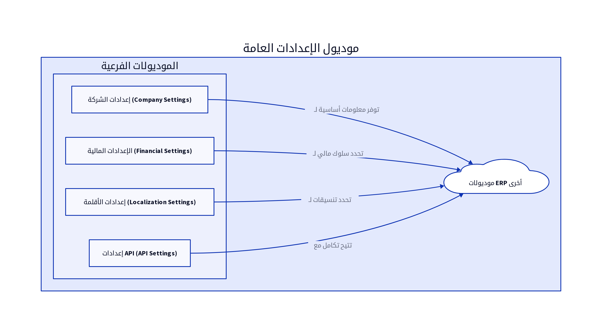

# الباب الحادي عشر: موديول الإعدادات العامة (General Settings Module)

## 11.1. نظرة عامة على الموديول

يُعد موديول الإعدادات العامة (General Settings Module) مركز التحكم المركزي لنظام ERP، حيث يتيح للمسؤولين تهيئة النظام ليناسب احتياجات المؤسسة المحددة. يهدف هذا الموديول إلى توفير المرونة في تخصيص سلوك النظام، من معلومات الشركة الأساسية إلى الإعدادات المالية، خيارات الأقلمة، والمظهر العام. كما يدير هذا الموديول إعدادات الربط البرمجي (API) لتمكين التكامل مع الأنظمة الخارجية [10].

## 11.2. تصميم قاعدة البيانات

يركز تصميم قاعدة البيانات لموديول الإعدادات العامة على تخزين جميع التكوينات والإعدادات التي تؤثر على سلوك النظام. فيما يلي المكونات الرئيسية لتصميم قاعدة البيانات:

### 11.2.1. إعدادات الشركة (Company Settings)

يخزن هذا الجدول المعلومات الأساسية عن الشركة التي تستخدم نظام ERP.

| الحقل (Field) | نوع البيانات (Data Type) | الوصف (Description) |
|---------------|--------------------------|---------------------|
| `company_id`  | `INT (PK)`               | معرف الشركة الفريد |
| `company_name`| `VARCHAR(255)`           | اسم الشركة |
| `address`     | `TEXT`                   | عنوان الشركة |
| `phone_number`| `VARCHAR(50)`            | رقم هاتف الشركة |
| `email`       | `VARCHAR(255)`           | البريد الإلكتروني للشركة |
| `tax_id`      | `VARCHAR(50)`            | الرقم الضريبي للشركة |
| `logo_url`    | `VARCHAR(255)`           | رابط شعار الشركة |

### 11.2.2. الإعدادات المالية (Financial Settings)

يخزن هذا الجدول الإعدادات المتعلقة بالجوانب المالية والمحاسبية للنظام.

| الحقل (Field) | نوع البيانات (Data Type) | الوصف (Description) |
|---------------|--------------------------|---------------------|
| `setting_id`  | `INT (PK)`               | معرف الإعداد الفريد |
| `company_id`  | `INT (FK)`               | معرف الشركة المرتبطة |
| `base_currency`| `VARCHAR(3)`             | العملة الأساسية للنظام |
| `default_tax_rate`| `DECIMAL(5,2)`           | نسبة الضريبة الافتراضية |
| `fiscal_year_start`| `DATE`                   | تاريخ بداية السنة المالية |
| `invoice_prefix`| `VARCHAR(10)`            | بادئة أرقام الفواتير |
| `journal_prefix`| `VARCHAR(10)`            | بادئة أرقام القيود اليومية |

### 11.2.3. إعدادات الأقلمة (Localization Settings)

يخزن هذا الجدول الإعدادات المتعلقة باللغة، المنطقة الزمنية، وتنسيقات التاريخ والوقت.

| الحقل (Field) | نوع البيانات (Data Type) | الوصف (Description) |
|---------------|--------------------------|---------------------|
| `setting_id`  | `INT (PK)`               | معرف الإعداد الفريد |
| `company_id`  | `INT (FK)`               | معرف الشركة المرتبطة |
| `language_code`| `VARCHAR(10)`            | رمز اللغة الافتراضية (مثال: ar, en) |
| `timezone`    | `VARCHAR(50)`            | المنطقة الزمنية الافتراضية |
| `date_format` | `VARCHAR(50)`            | تنسيق التاريخ الافتراضي |
| `time_format` | `VARCHAR(50)`            | تنسيق الوقت الافتراضي |

### 11.2.4. إعدادات API (API Settings)

يخزن هذا الجدول مفاتيح API المستخدمة للتكامل مع الأنظمة الخارجية، بالإضافة إلى إعدادات الأمان المتعلقة بها.

| الحقل (Field) | نوع البيانات (Data Type) | الوصف (Description) |
|---------------|--------------------------|---------------------|
| `api_key_id`  | `INT (PK)`               | معرف مفتاح API الفريد |
| `company_id`  | `INT (FK)`               | معرف الشركة المرتبطة |
| `api_key`     | `VARCHAR(255)`           | مفتاح API (مشفر) |
| `description` | `TEXT`                   | وصف لمفتاح API (الغرض منه) |
| `created_by`  | `INT (FK)`               | معرف المستخدم الذي أنشأ المفتاح |
| `created_date`| `DATETIME`               | تاريخ إنشاء المفتاح |
| `is_active`   | `BOOLEAN`                | حالة المفتاح (نشط/غير نشط) |

## 11.3. المنطق البرمجي الأساسي

يتضمن المنطق البرمجي لموديول الإعدادات العامة مجموعة من العمليات التي تضمن تطبيق التكوينات بشكل صحيح على مستوى النظام:

### 11.3.1. إدارة بيانات الشركة

يتيح النظام للمسؤولين تحديث معلومات الشركة الأساسية، مثل الاسم، العنوان، ومعلومات الاتصال. يتم استخدام هذه المعلومات في جميع أنحاء النظام، مثل الفواتير والتقارير.

### 11.3.2. تطبيق الإعدادات على مستوى النظام

يتم تطبيق الإعدادات المخزنة في هذا الموديول على جميع الموديولات الأخرى. على سبيل المثال، يتم استخدام العملة الأساسية في جميع المعاملات المالية، ويتم استخدام تنسيق التاريخ الافتراضي في جميع العروض والتقارير.

### 11.3.3. توليد مفاتيح API وإدارتها

يتيح الموديول للمسؤولين توليد مفاتيح API جديدة، وتعيين صلاحيات محددة لكل مفتاح، وتتبع استخدامها. يجب أن يتم تخزين مفاتيح API بشكل آمن (مشفرة) وأن يتم توفير آليات لإلغاء تنشيطها عند الحاجة [10].

## 11.4. واجهات برمجة التطبيقات (APIs)

تُعد APIs لموديول الإعدادات العامة ضرورية لتمكين الموديولات الأخرى من الوصول إلى الإعدادات، وللسماح للمسؤولين بتحديثها برمجياً.

*   `GET /settings`: لاستعراض جميع الإعدادات العامة للشركة. يمكن أن يدعم فلاتر للبحث حسب نوع الإعداد [10].
*   `PUT /settings`: لتحديث إعدادات عامة محددة. يتطلب هذا الـ API معرف الإعداد والبيانات المراد تحديثها [10].
*   `POST /api_keys`: لتوليد مفتاح API جديد. يتطلب هذا الـ API وصفاً للمفتاح والصلاحيات المراد منحها [10].
*   `GET /api_keys`: لاستعراض جميع مفاتيح API الموجودة [10].
*   `PUT /api_keys/{id}`: لتحديث حالة أو صلاحيات مفتاح API موجود [10].
*   `DELETE /api_keys/{id}`: لحذف مفتاح API [10].

## المراجع (References)

[1] What Is ERP Architecture? Models, Types, and More [2024] - Spinnaker Support. (2024, August 2). Retrieved from https://www.spinnakersupport.com/blog/2024/08/02/erp-architecture/
[2] 8 Core Components of ERP Systems - NetSuite. (2026, April 7). Retrieved from https://www.netsuite.com/portal/resource/articles/erp/erp-systems-components.shtml
[3] ERP System Architecture Explained in Layman\"s Terms - Visual South. (2026, January 20). Retrieved from https://www.visualsouth.com/blog/architecture-of-erp
[4] What Is ERP System Architecture? (Benefits, Types & Differ) - Synconics. Retrieved from https://www.synconics.com/erp-architecture
[5] ERP Fundamentals: How Is ERP Built? Architecture Explained - Resulting IT. (2023, January 24). Retrieved from https://www.resulting-it.com/erp-insights-blog/build-erp-project-integration
[6] ERP System: Modules, Integrated Workings, Landscapes, Master ... - LinkedIn. (2025, October 21). Retrieved from https://www.linkedin.com/pulse/erp-system-modules-integrated-workings-landscapes-master-rahul-sharma-kwgxc
[7] Daftra API: Welcome - Daftra API. Retrieved from https://docs.daftara.dev/
[8] Integration using the Application Programming Interface (API) - Daftra. Retrieved from https://docs.daftara.com/en/tutorial/api/
[9] Api V2 Docs - Daftra. Retrieved from https://azmart.daftra.com/api_docs/v2/
[10] Endpoints Structure - Daftra API. Retrieved from https://docs.daftara.dev/1259001m0
[11] API - Daftra Knowledge Base. Retrieved from https://docs.daftara.com/en/category/developers/api-en/
[12] How to Conduct an Effective Inventory Audit: Best Practices - VersaCloud ERP. (2024, October 28). Retrieved from https://www.versaclouderp.com/blog/how-to-conduct-an-effective-inventory-audit-best-practices/
[13] A Guide to ERP Software for Financial Systems | RubinBrown. (2025, January 24). Retrieved from https://www.rubinbrown.com/insights-events/insight-articles/essential-erp-features-for-an-effective-financial-management-system/
[14] A Guide to Inventory Audits: Meaning, Types & Best Practices - QuickDice ERP. (2025, November 8). Retrieved from https://quickdiceerp.com/blog/a-guide-to-inventory-audits-meaning-types-best-practices
[15] ERP Implementation: The 9-Step Guide – Forbes Advisor. (2024, July 9). Retrieved from https://www.forbes.com/advisor/business/erp-implementation/
