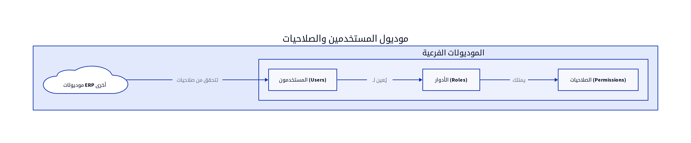

# الباب الثاني عشر: موديول المستخدمين والصلاحيات (Users and Roles Module)

## 12.1. نظرة عامة على الموديول

يُعد موديول المستخدمين والصلاحيات (Users and Roles Module) عنصراً حيوياً في أي نظام ERP، حيث يتولى مسؤولية إدارة الوصول إلى النظام وموارده. يهدف هذا الموديول إلى ضمان أن المستخدمين المصرح لهم فقط هم من يمكنهم الوصول إلى البيانات والوظائف المناسبة، مما يحافظ على أمان النظام وسلامة البيانات. تشمل الوظائف الرئيسية لهذا الموديول إدارة حسابات المستخدمين، تعريف الأدوار، تخصيص الصلاحيات، وتتبع نشاط المستخدمين [15].

## 12.2. تصميم قاعدة البيانات

يركز تصميم قاعدة البيانات لموديول المستخدمين والصلاحيات على تخزين معلومات المستخدمين، الأدوار، والصلاحيات، بالإضافة إلى ربطها ببعضها البعض. فيما يلي المكونات الرئيسية لتصميم قاعدة البيانات:

### 12.2.1. المستخدمون (Users)

يخزن هذا الجدول المعلومات الأساسية لكل مستخدم يمكنه الوصول إلى نظام ERP.

| الحقل (Field) | نوع البيانات (Data Type) | الوصف (Description) |
|---------------|--------------------------|---------------------|
| `user_id`     | `INT (PK)`               | معرف المستخدم الفريد |
| `username`    | `VARCHAR(100)`           | اسم المستخدم (فريد) |
| `email`       | `VARCHAR(255)`           | البريد الإلكتروني للمستخدم (فريد) |
| `password_hash`| `VARCHAR(255)`           | كلمة المرور المشفرة |
| `first_name`  | `VARCHAR(100)`           | الاسم الأول للمستخدم |
| `last_name`   | `VARCHAR(100)`           | الاسم الأخير للمستخدم |
| `is_active`   | `BOOLEAN`                | حالة الحساب (نشط/غير نشط) |
| `created_date`| `DATETIME`               | تاريخ إنشاء الحساب |
| `last_login`  | `DATETIME`               | آخر تاريخ تسجيل دخول |

### 12.2.2. الأدوار (Roles)

يخزن هذا الجدول تعريفات الأدوار الوظيفية المختلفة داخل المؤسسة، مثل مدير مبيعات، محاسب، مدير مخزون.

| الحقل (Field) | نوع البيانات (Data Type) | الوصف (Description) |
|---------------|--------------------------|---------------------|
| `role_id`     | `INT (PK)`               | معرف الدور الفريد |
| `role_name`   | `VARCHAR(100)`           | اسم الدور (مثال: مدير مبيعات) |
| `description` | `TEXT`                   | وصف الدور |

### 12.2.3. الصلاحيات (Permissions)

يخزن هذا الجدول الصلاحيات الفردية التي يمكن منحها للمستخدمين أو الأدوار، مثل عرض الفواتير، إنشاء منتج جديد، أو تعديل إعدادات النظام.

| الحقل (Field) | نوع البيانات (Data Type) | الوصف (Description) |
|---------------|--------------------------|---------------------|
| `permission_id`| `INT (PK)`               | معرف الصلاحية الفريد |
| `permission_name`| `VARCHAR(100)`           | اسم الصلاحية (مثال: invoices.view, products.create) |
| `description` | `TEXT`                   | وصف الصلاحية |

### 12.2.4. ربط المستخدمين بالأدوار (User-Role Mapping)

يربط هذا الجدول المستخدمين بالأدوار التي ينتمون إليها. يمكن للمستخدم الواحد أن ينتمي إلى دور واحد أو أكثر.

| الحقل (Field) | نوع البيانات (Data Type) | الوصف (Description) |
|---------------|--------------------------|---------------------|
| `user_role_id`| `INT (PK)`               | معرف الربط الفريد |
| `user_id`     | `INT (FK)`               | معرف المستخدم |
| `role_id`     | `INT (FK)`               | معرف الدور |

### 12.2.5. ربط الأدوار بالصلاحيات (Role-Permission Mapping)

يربط هذا الجدول الأدوار بالصلاحيات التي يمتلكها كل دور. يتم تحديد الصلاحيات التي يمتلكها المستخدم بناءً على الأدوار التي ينتمي إليها.

| الحقل (Field) | نوع البيانات (Data Type) | الوصف (Description) |
|---------------|--------------------------|---------------------|
| `role_permission_id`| `INT (PK)`               | معرف الربط الفريد |
| `role_id`     | `INT (FK)`               | معرف الدور |
| `permission_id`| `INT (FK)`               | معرف الصلاحية |

## 12.3. المنطق البرمجي الأساسي

يتضمن المنطق البرمجي لموديول المستخدمين والصلاحيات مجموعة من العمليات التي تضمن إدارة آمنة وفعالة للوصول:

### 12.3.1. إنشاء وإدارة حسابات المستخدمين

يتيح النظام للمسؤولين إنشاء حسابات مستخدمين جديدة، وتعيين كلمات مرور، وتحديث معلومات المستخدمين، وتنشيط أو إلغاء تنشيط الحسابات. يجب أن يتضمن النظام آليات قوية لتشفير كلمات المرور (مثل استخدام دوال التجزئة الآمنة) [15].

### 12.3.2. تعريف الأدوار وتخصيص الصلاحيات

يمكن للمسؤولين تعريف أدوار جديدة، وتعيين مجموعة من الصلاحيات لكل دور. يتم تبسيط إدارة الصلاحيات من خلال تعيين الأدوار للمستخدمين بدلاً من تعيين الصلاحيات بشكل فردي لكل مستخدم [15].

### 12.3.3. آلية التحقق من الصلاحيات (Permission Checking)

عند محاولة المستخدم الوصول إلى وظيفة أو بيانات معينة، يقوم النظام بالتحقق من الصلاحيات التي يمتلكها المستخدم (من خلال أدواره) للتأكد من أنه مصرح له بالقيام بهذا الإجراء. يجب أن تكون هذه الآلية فعالة وسريعة لضمان عدم تأثر أداء النظام [15].

## 12.4. واجهات برمجة التطبيقات (APIs)

تُعد APIs لموديول المستخدمين والصلاحيات ضرورية لإدارة المستخدمين والأدوار والصلاحيات برمجياً، ولتمكين الموديولات الأخرى من التحقق من صلاحيات المستخدمين.

*   `POST /users`: لإضافة مستخدم جديد. يتطلب هذا الـ API بيانات المستخدم الأساسية مثل `username`, `email`, `password`, `first_name`, `last_name` [10].
*   `GET /users`: لاستعراض جميع المستخدمين. يمكن أن يدعم فلاتر للبحث حسب اسم المستخدم، البريد الإلكتروني، أو الحالة [10].
*   `GET /users/{id}`: لاستعراض تفاصيل مستخدم محدد باستخدام معرف المستخدم (`user_id`) [10].
*   `PUT /users/{id}`: لتعديل بيانات مستخدم موجود. يتطلب معرف المستخدم (`user_id`) والبيانات المراد تحديثها [10].
*   `DELETE /users/{id}`: لحذف مستخدم. يتطلب معرف المستخدم (`user_id`). يجب أن يتم التحقق من عدم وجود سجلات مرتبطة بالمستخدم قبل الحذف [10].
*   `POST /roles`: لإضافة دور جديد. يتطلب هذا الـ API اسم الدور ووصفه [10].
*   `GET /roles`: لاستعراض جميع الأدوار [10].
*   `PUT /roles/{id}`: لتعديل دور موجود [10].
*   `DELETE /roles/{id}`: لحذف دور [10].
*   `POST /roles/{role_id}/permissions`: لربط صلاحيات بدور معين [10].
*   `GET /permissions`: لاستعراض جميع الصلاحيات المتاحة [10].

## 12.5. التقارير

يوفر موديول المستخدمين والصلاحيات مجموعة من التقارير التي تساعد في مراقبة الوصول والأمان:

*   **قائمة المستخدمين النشطين (Active Users Report):** يُظهر قائمة بجميع المستخدمين النشطين في النظام [6].
*   **تقرير صلاحيات الأدوار (Role Permissions Matrix):** يُوضح الصلاحيات الممنوحة لكل دور، مما يساعد في مراجعة وتدقيق الصلاحيات [6].
*   **تقرير نشاط المستخدمين (User Activity Report):** يُظهر سجلات الأنشطة التي قام بها كل مستخدم، مما يساعد في تتبع الإجراءات والتحقيق في الحوادث الأمنية.

## الخاتمة

لقد استعرض هذا الكتاب البنية التقنية الأساسية لنظام تخطيط موارد المؤسسات (ERP) وموديولاته الرئيسية. من خلال فهم هذه المكونات وتصميمها بعناية، يمكن للمطورين ومهندسي الحلول بناء أنظمة ERP قوية، قابلة للتوسع، وآمنة تلبي احتياجات المؤسسات الحديثة. إن التركيز على البنية المعمارية السليمة، تصميم قواعد البيانات الفعال، واجهات برمجة التطبيقات المرنة، واعتبارات الأمان، سيضمن نجاح أي مشروع لتطوير نظام ERP.

## المراجع (References)

[1] What Is ERP Architecture? Models, Types, and More [2024] - Spinnaker Support. (2024, August 2). Retrieved from https://www.spinnakersupport.com/blog/2024/08/02/erp-architecture/
[2] 8 Core Components of ERP Systems - NetSuite. (2026, April 7). Retrieved from https://www.netsuite.com/portal/resource/articles/erp/erp-systems-components.shtml
[3] ERP System Architecture Explained in Layman\"s Terms - Visual South. (2026, January 20). Retrieved from https://www.visualsouth.com/blog/architecture-of-erp
[4] What Is ERP System Architecture? (Benefits, Types & Differ) - Synconics. Retrieved from https://www.synconics.com/erp-architecture
[5] ERP Fundamentals: How Is ERP Built? Architecture Explained - Resulting IT. (2023, January 24). Retrieved from https://www.resulting-it.com/erp-insights-blog/build-erp-project-integration
[6] ERP System: Modules, Integrated Workings, Landscapes, Master ... - LinkedIn. (2025, October 21). Retrieved from https://www.linkedin.com/pulse/erp-system-modules-integrated-workings-landscapes-master-rahul-sharma-kwgxc
[7] Daftra API: Welcome - Daftra API. Retrieved from https://docs.daftara.dev/
[8] Integration using the Application Programming Interface (API) - Daftra. Retrieved from https://docs.daftara.com/en/tutorial/api/
[9] Api V2 Docs - Daftra. Retrieved from https://azmart.daftra.com/api_docs/v2/
[10] Endpoints Structure - Daftra API. Retrieved from https://docs.daftara.dev/1259001m0
[11] API - Daftra Knowledge Base. Retrieved from https://docs.daftara.com/en/category/developers/api-en/
[12] How to Conduct an Effective Inventory Audit: Best Practices - VersaCloud ERP. (2024, October 28). Retrieved from https://www.versaclouderp.com/blog/how-to-conduct-an-effective-inventory-audit-best-practices/
[13] A Guide to ERP Software for Financial Systems | RubinBrown. (2025, January 24). Retrieved from https://www.rubinbrown.com/insights-events/insight-articles/essential-erp-features-for-an-effective-financial-management-system/
[14] A Guide to Inventory Audits: Meaning, Types & Best Practices - QuickDice ERP. (2025, November 8). Retrieved from https://quickdiceerp.com/blog/a-guide-to-inventory-audits-meaning-types-best-practices
[15] ERP Implementation: The 9-Step Guide – Forbes Advisor. (2024, July 9). Retrieved from https://www.forbes.com/advisor/business/erp-implementation/
